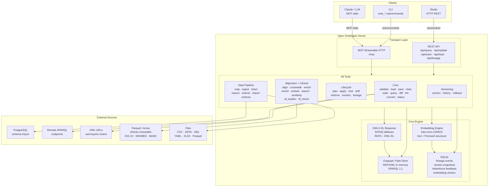
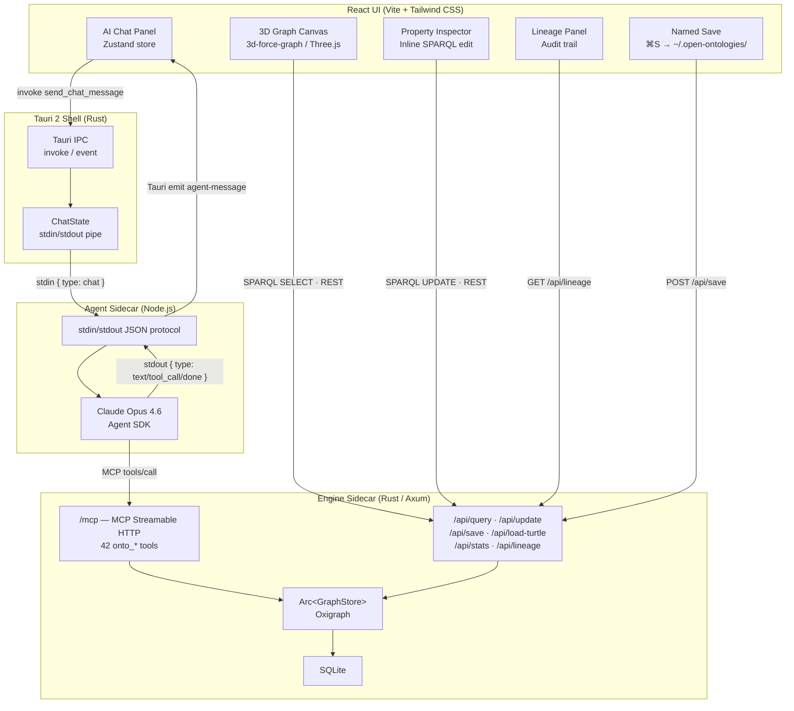

<!-- mcp-name: io.github.fabio-rovai/open-ontologies -->

<p align="center">
  
</p>

<h1 align="center">Open Ontologies</h1>

<p align="center">
  <strong>A Terraforming MCP for Knowledge Graphs</strong><br>
  Validate, classify, and govern AI-generated ontologies. Written in Rust. Ships as a single binary.
</p>

<p align="center">
  <a href="https://github.com/fabio-rovai/open-ontologies/actions/workflows/ci.yml"></a>
  <a href="LICENSE"></a>
  <a href="https://openmcp.org/servers/open-ontologies"></a>
  <a href="https://www.pitchhut.com/project/open-ontologies-mcp"></a>
  <a href="https://clawhub.ai/fabio-rovai/open-ontologies"></a>
</p>

<p align="center">
  <a href="#quick-start-mcp--cli">Quick Start</a> ·
  <a href="#studio-desktop-app">Studio</a> ·
  <a href="#benchmarks">Benchmarks</a> ·
  <a href="#ies-support">IES</a> ·
  <a href="#tools">Tools</a> ·
  <a href="#architecture">Architecture</a> ·
  <a href="#documentation">Docs</a>
</p>

---

Open Ontologies is a **Rust MCP server** and **desktop Studio** for AI-native ontology engineering. It exposes **48 tools** that let Claude build, validate, query, diff, lint, version, reason over, align, and persist RDF/OWL ontologies using an in-memory Oxigraph triple store — with Terraform-style lifecycle management, a marketplace of 32 standard ontologies, clinical crosswalks, semantic embeddings, and a full lineage audit trail.

The **Studio** wraps the engine in a visual desktop environment: 3D force-directed graph, AI chat panel, Protégé-style property inspector, and lineage viewer.

No JVM. No Protégé. No GUI required.

---

## Screenshots

| Full UI | 3D Graph |
|---|---|
|  |  |

*Tissue ontology built in natural language. Gold edges show object property relationships (domain → range) connecting clusters; grey edges show subClassOf hierarchy. Spring-based force layout keeps related classes close.*

---

## Quick Start (MCP / CLI)

### Install

**Pre-built binaries:**

```bash
# macOS (Apple Silicon)
curl -LO https://github.com/fabio-rovai/open-ontologies/releases/latest/download/open-ontologies-aarch64-apple-darwin
chmod +x open-ontologies-aarch64-apple-darwin && mv open-ontologies-aarch64-apple-darwin /usr/local/bin/open-ontologies

# macOS (Intel)
curl -LO https://github.com/fabio-rovai/open-ontologies/releases/latest/download/open-ontologies-x86_64-apple-darwin
chmod +x open-ontologies-x86_64-apple-darwin && mv open-ontologies-x86_64-apple-darwin /usr/local/bin/open-ontologies

# Linux (x86_64)
curl -LO https://github.com/fabio-rovai/open-ontologies/releases/latest/download/open-ontologies-x86_64-unknown-linux-gnu
chmod +x open-ontologies-x86_64-unknown-linux-gnu && mv open-ontologies-x86_64-unknown-linux-gnu /usr/local/bin/open-ontologies
```

**Docker:**

```bash
docker pull ghcr.io/fabio-rovai/open-ontologies:latest
docker run -i ghcr.io/fabio-rovai/open-ontologies serve
```

**From source (Rust 1.85+):**

```bash
git clone https://github.com/fabio-rovai/open-ontologies.git
cd open-ontologies && cargo build --release
./target/release/open-ontologies init
```

### Connect to your MCP client

<details>
<summary><strong>Claude Code</strong></summary>

Add to `~/.claude/settings.json`:

```json
{
  "mcpServers": {
    "open-ontologies": {
      "command": "/path/to/open-ontologies/target/release/open-ontologies",
      "args": ["serve"]
    }
  }
}
```

Restart Claude Code. The `onto_*` tools are now available.
</details>

<details>
<summary><strong>Claude Desktop</strong></summary>

Add to `~/Library/Application Support/Claude/claude_desktop_config.json`:

```json
{
  "mcpServers": {
    "open-ontologies": {
      "command": "/path/to/open-ontologies/target/release/open-ontologies",
      "args": ["serve"]
    }
  }
}
```

</details>

<details>
<summary><strong>Cursor / Windsurf / any MCP-compatible IDE</strong></summary>

Add to `.cursor/mcp.json` or equivalent:

```json
{
  "mcpServers": {
    "open-ontologies": {
      "command": "/path/to/open-ontologies/target/release/open-ontologies",
      "args": ["serve"]
    }
  }
}
```

</details>

<details>
<summary><strong>Docker</strong></summary>

```json
{
  "mcpServers": {
    "open-ontologies": {
      "command": "docker",
      "args": ["run", "-i", "--rm", "ghcr.io/fabio-rovai/open-ontologies", "serve"]
    }
  }
}
```

</details>

### Build your first ontology

```text
Build me a Pizza ontology following the Manchester University tutorial.
Include all 49 toppings, 22 named pizzas, spiciness value partition,
and defined classes (VegetarianPizza, MeatyPizza, SpicyPizza).
Validate it, load it, and show me the stats.
```

Claude generates Turtle, then runs the full pipeline automatically:

`onto_validate` → `onto_load` → `onto_stats` → `onto_reason` → `onto_stats` → `onto_lint` → `onto_enforce` → `onto_query` → `onto_save` → `onto_version`

Every build includes OWL reasoning (materializes inferred triples), design pattern enforcement, and automatic versioning.

---

## Studio (Desktop App)

The Studio lives in [`studio/`](studio/) — a Tauri 2 desktop app that provides a visual interface on top of the same engine.

**Prerequisites:** Rust + Cargo · Node.js 18+

```bash
# 1. Build the engine binary (from repo root)
cargo build --release

# 2. Install JS dependencies
cd studio && npm install

# 3. Run
PATH=/opt/homebrew/bin:~/.cargo/bin:$PATH npm run tauri dev
```

### Studio Features

| Feature | Description |
| --- | --- |
| **3D Graph Canvas** | Spring-based force-directed OWL graph (Three.js / WebGL). Grey edges = subClassOf hierarchy, gold edges = object property domain/range links. Drag to orbit, scroll to zoom, click to inspect, right-click to add, Delete to remove. |
| **AI Agent Chat** | Natural language ontology engineering via Claude Opus 4.6 + Agent SDK. Type instructions — Claude calls the right tools automatically. |
| **Property Inspector** | Protégé-style inline triple editor. Click to edit, hover to delete, `+ Add` for new triples. |
| **Lineage Panel** | Full audit trail from SQLite: plan · apply · enforce · drift · monitor · align, grouped by session. |
| **Named Save** | ⌘S to save as `~/.open-ontologies/<name>.ttl`. Auto-saves to `studio-live.ttl` after every mutation. |

**Keyboard shortcuts:** `⌘J` chat · `⌘I` inspector · `⌘S` save · `Delete` remove node

---

## Benchmarks

### OntoAxiom — LLM Axiom Identification

[OntoAxiom](https://arxiv.org/abs/2512.05594) tests axiom identification across 9 ontologies and 3,042 ground truth axioms.

| Approach | F1 | vs o1 (paper best) |
| --- | --- | --- |
| o1 (paper's best) | 0.197 | — |
| Bare Claude Opus | 0.431 | **+119%** |
| **MCP extraction** | **0.717** | **+264%** |

### Pizza Ontology — Manchester Tutorial

One sentence input: *"Build a Pizza ontology following the Manchester tutorial specification."*

| Metric | Reference (Protégé, ~4 hours) | AI-Generated (~5 min) | Coverage |
| --- | --- | --- | --- |
| Classes | 99 | 95 | **96%** |
| Properties | 8 | 8 | **100%** |
| Toppings | 49 | 49 | **100%** |
| Named Pizzas | 24 | 24 | **100%** |

### Mushroom Classification — OWL Reasoning vs Expert Labels

**Dataset:** UCI Mushroom Dataset — 8,124 specimens classified by mycology experts.

| Metric | Result |
| --- | --- |
| Accuracy | **98.33%** |
| Recall (poisonous) | **100%** — zero toxic mushrooms missed |
| False negatives | **0** |
| Classification rules | 6 OWL axioms |

### Ontology Marketplace — 29 Standard Ontologies

All 29 marketplace ontologies fetched, `owl:imports` resolved, loaded, and reasoned over with both RDFS and OWL-RL profiles:

| Ontology | Classes | Properties | Triples | + RDFS | + OWL-RL | Fetch | RDFS | OWL-RL |
| --- | ---: | ---: | ---: | ---: | ---: | ---: | ---: | ---: |
| OWL 2 | 32 | 4 | 537 | +230 | +230 | 681ms | 6ms | 3ms |
| RDF Schema | 6 | 0 | 87 | +35 | +35 | 522ms | 2ms | 1ms |
| RDF Concepts | 7 | 0 | 127 | +31 | +31 | 545ms | 2ms | 2ms |
| BFO (ISO 21838) | 35 | 0 | 1,221 | +186 | +186 | 1,141ms | 5ms | 4ms |
| DOLCE/DUL | 93 | 118 | 1,917 | +666 | +692 | 2,208ms | 13ms | 12ms |
| Schema.org | 1,009 | 0 | 17,823 | +4,031 | **+13,670** | 558ms | 57ms | 117ms |
| FOAF | 28 | 60 | 631 | +4 | +31 | 940ms | 3ms | 2ms |
| SKOS | 5 | 18 | 252 | +55 | +55 | 218ms | 2ms | 1ms |
| Dublin Core Elements | 0 | 0 | 107 | +0 | +0 | 371ms | 2ms | 1ms |
| Dublin Core Terms | 22 | 0 | 700 | +256 | +261 | 259ms | 4ms | 3ms |
| DCAT | 58 | 89 | 2,841 | +223 | +254 | 975ms | 15ms | 11ms |
| VoID | 8 | 8 | 216 | +0 | +0 | 531ms | 2ms | 2ms |
| DOAP | 17 | 0 | 741 | +0 | +0 | 727ms | 2ms | 2ms |
| PROV-O | 39 | 50 | 1,146 | +202 | +203 | 472ms | 5ms | 4ms |
| OWL-Time | 23 | 58 | 1,296 | +165 | +165 | 256ms | 5ms | 4ms |
| W3C Organization | 22 | 33 | 748 | +9 | +21 | 639ms | 4ms | 3ms |
| SSN | 35 | 38 | 1,815 | +84 | +84 | 519ms | 6ms | 4ms |
| SOSA | 29 | 23 | 396 | +0 | +0 | 1,264ms | 3ms | 2ms |
| GeoSPARQL | 12 | 54 | 796 | +4 | +12 | 733ms | 3ms | 3ms |
| LOCN | 2 | 0 | 206 | +0 | +0 | 1,031ms | 2ms | 1ms |
| SHACL | 40 | 0 | 1,128 | +268 | +268 | 662ms | 5ms | 3ms |
| vCard | 75 | 84 | 882 | +0 | +46 | 854ms | 3ms | 3ms |
| ODRL | 71 | 50 | 2,157 | +73 | +76 | 798ms | 6ms | 5ms |
| Creative Commons | 6 | 0 | 115 | +0 | +49 | 184ms | 1ms | 1ms |
| SIOC | 14 | 83 | 615 | +0 | +2 | 863ms | 3ms | 2ms |
| ADMS | 4 | 13 | 151 | +0 | +0 | 747ms | 3ms | 1ms |
| GoodRelations | 98 | 102 | 1,834 | +15 | +42 | 2,299ms | 6ms | 6ms |
| FIBO (metadata) | 0 | 0 | 45 | +0 | +0 | 1,524ms | 3ms | 1ms |
| QUDT | 73 | 175 | 2,434 | +1,574 | +1,581 | 2,934ms | 14ms | 9ms |
| **Total** | **1,863** | **1,060** | **42,964** | **+8,111** | **+17,994** | — | — | — |

29/29 ontologies loaded, imports resolved, and reasoned. RDFS adds 18% more triples. OWL-RL adds **41%** — transitive/symmetric/inverse properties and equivalentClass expansion discover significantly more implicit knowledge. Schema.org jumps from +4,031 (RDFS) to +13,670 (OWL-RL) inferred triples in 117ms.

### Reasoning Performance — vs HermiT

**LUBM Scaling (load + reason cycle)**

| Axioms | Open Ontologies | HermiT | Speedup |
| --- | --- | --- | --- |
| 1,000 | 15ms | 112ms | **7.5×** |
| 5,000 | 14ms | 410ms | **29×** |
| 10,000 | 14ms | 1,200ms | **86×** |
| 50,000 | 15ms | 24,490ms | **1,633×** |

Full benchmark writeup: [docs/benchmarks.md](docs/benchmarks.md)

---

## IES Support

[IES (Information Exchange Standard)](https://github.com/IES-Org) is the UK National Digital Twin Programme's core ontology framework. It uses a 4D extensionalist (BORO) approach for modelling entities, events, states, and relationships. Open Ontologies supports the **full IES stack** — all three layers, SHACL shapes, and 42+ example datasets.

### The IES Layers

The marketplace includes all three tiers of the IES framework:

```text
onto_marketplace install ies-top     # ToLO — BORO foundations (~22 classes)
onto_marketplace install ies-core    # Core — persons, states, events (~131 classes)
onto_marketplace install ies         # Common — full ontology (513 classes, 206 properties)
```

### Benchmark

| Metric | IES Common |
| --- | --- |
| Classes | 513 |
| Object properties | 206 |
| Triples loaded | 4,040 |
| + RDFS inferred | **+3,094 (+77%)** |
| Fetch time | 911ms |
| RDFS reasoning | 63ms |
| Lint issues | 0 |

IES is the second-largest ontology in the marketplace by class count (after Schema.org). RDFS reasoning produces the richest inference gain of any non-general ontology — 241 State subclasses, 117 ClassOfEntity subclasses, and 102 Event subclasses all generating transitive chains.

### Example Data

Load any of the 42+ IES example datasets directly:

```text
onto_pull https://raw.githubusercontent.com/IES-Org/ont-ies/main/docs/examples/sample-data/event-participation.ttl
onto_pull https://raw.githubusercontent.com/IES-Org/ont-ies/main/docs/examples/sample-data/hospital.ttl
onto_pull https://raw.githubusercontent.com/telicent-oss/ies-examples/main/additional_examples/ship_movement.ttl
```

### SHACL Validation

```text
onto_pull https://raw.githubusercontent.com/IES-Org/ont-ies/main/docs/specification/ies-common.shacl
onto_shacl
```

### Data Mapping: EPC → IES

The repo includes a sample of real UK Energy Performance Certificates ([benchmark/epc/epc-sample.csv](benchmark/epc/epc-sample.csv)) with a mapping config that transforms tabular EPC data into IES-shaped RDF:

```text
onto_load benchmark/generated/ies-building-extension.ttl
onto_ingest benchmark/epc/epc-sample.csv --mapping benchmark/epc/epc-ies-mapping.json
onto_reason --profile rdfs
```

This mirrors NDTP's actual pipeline: CSV → IES RDF → validate → reason → query.

### IES Building Extension — vs NDTP/IRIS Production Ontology

The repo includes an [IES Building Extension](benchmark/generated/ies-building-extension.ttl) built from the UK EPC data schema and building science fundamentals, using IES 4D patterns. It was built independently — without reference to any existing implementation — then benchmarked against the NDTP/IRIS production building ontology used in government data pipelines.

| Metric | NDTP/IRIS | Open Ontologies |
| --- | ---: | ---: |
| Classes | 192 | **455** |
| Entity classes | 133 | **187** |
| State classes | 41 | **129** |
| ClassOf classes | 37 | **139** |
| Complete 4D triads | 14 | **129** |
| Properties | 26 | **93** |
| Enumerated individuals | 2 | **132** |
| Domain/range coverage | 31 | **86** |
| Labels | 311 | **524** |
| Comments | 316 | **524** |
| Validated triples | — | **3,056** |

Built blind from the 105-column EPC schema, SAP methodology, and BORO 4D extensionalism — zero reference to the IRIS implementation. Every class is traceable to an EPC column, an EPC data value, or the mechanical 4D completion rule. Covers spatial hierarchy, thermal envelope with construction/insulation type decomposition, heating production/distribution/controls with device-level detail, hot water sources, lighting, ventilation types, renewables, energy supply connections, EPC assessment activities per element, cost estimates per system, current/potential scenarios, and retrofit events.

### EPC Column Coverage Benchmark

Both ontologies tested against 30 key EPC data columns — can each ontology receive and represent the data from that column?

| Metric | NDTP/IRIS | Open Ontologies |
| --- | ---: | ---: |
| EPC columns covered | 18/30 (60%) | **28/30 (93%)** |
| Validated triples | 1,349 | **3,056** |

Queries derived from published DESNZ/ONS EPC statistical reports — not from either ontology's class structure. Full benchmark: [benchmark/epc/](benchmark/epc/)

Use `onto_align` to map it to other domain ontologies:

```text
onto_load benchmark/generated/ies-building-extension.ttl
onto_align <other-ontology.ttl>
```

### Further Reading

| Topic | Link |
| --- | --- |
| IES Ecosystem Demo | [docs/ies-ecosystem.md](docs/ies-ecosystem.md) |
| SPARQL Examples | [docs/ies-examples.md](docs/ies-examples.md) |
| Building Alignment | [docs/ies-alignment.md](docs/ies-alignment.md) |

---

## Tools

48 tools organized by function — available as MCP tools (prefixed `onto_`) and CLI subcommands:

| Category | Tools | Purpose |
| --- | --- | --- |
| **Core** | `validate` `load` `save` `clear` `stats` `query` `diff` `lint` `convert` `status` | RDF/OWL validation, querying, and management |
| **Marketplace** | `marketplace` | Browse and install 30 standard W3C/ISO/industry ontologies |
| **Remote** | `pull` `push` `import-owl` | Fetch/push ontologies, resolve owl:imports |
| **Schema** | `import-schema` | PostgreSQL → OWL conversion |
| **Data** | `map` `ingest` `shacl` `reason` `extend` | Structured data → RDF pipeline |
| **Versioning** | `version` `history` `rollback` | Named snapshots and rollback |
| **Lifecycle** | `plan` `apply` `lock` `drift` `enforce` `monitor` `monitor-clear` `lineage` | Terraform-style change management with webhook alerts and [OpenCheir](https://github.com/fabio-rovai/opencheir) governance integration |
| **Alignment** | `align` `align-feedback` | Cross-ontology class matching with self-calibrating confidence |
| **Clinical** | `crosswalk` `enrich` `validate-clinical` | ICD-10 / SNOMED / MeSH crosswalks |
| **Feedback** | `lint-feedback` `enforce-feedback` | Self-calibrating suppression |
| **Embeddings** | `embed` `search` `similarity` | Dual-space semantic search (text + Poincaré structural) |
| **Reasoning** | `reason` `dl_explain` `dl_check` | Native OWL2-DL SHOIQ tableaux reasoner |

---

## Architecture

### Engine



### Studio



### Design decisions

| Decision | Reason |
| --- | --- |
| UI reads use sessionless REST | No MCP session management needed for SPARQL queries or stats |
| UI writes use REST `/api/update` + `/api/save` | Avoids session lifecycle issues in the Tauri WebKit webview |
| Agent writes go through MCP `tools/call` | The Agent SDK manages its own MCP session; Claude needs the full tool set |
| Shared `Arc<GraphStore>` | All MCP sessions and REST handlers share the same in-memory triple store |
| Agent sidecar over stdin/stdout | Keeps Node.js isolated; Tauri manages the full lifecycle |

---

## Stack

| Layer | Tech |
| --- | --- |
| Engine language | Rust (edition 2024) — single binary, no JVM |
| Triple store | Oxigraph 0.4 — pure Rust RDF/SPARQL 1.1 engine |
| MCP protocol | rmcp — Streamable HTTP transport |
| State / lineage / feedback | SQLite (rusqlite) |
| Clinical crosswalks | Apache Arrow / Parquet |
| Embeddings runtime | tract-onnx — pure Rust ONNX (optional) |
| Desktop shell | Tauri 2 |
| Frontend | React 19, Vite 7, TypeScript 5.8, Tailwind CSS 4 |
| 3D graph | 3d-force-graph 1.79 (Three.js / WebGL) |
| UI state | Zustand 5 |
| AI agent | Claude Opus 4.6 via Agent SDK (Node.js sidecar) |

---

## Documentation

| Topic | Link |
| --- | --- |
| Quickstart | [docs/quickstart.md](docs/quickstart.md) |
| Data Pipeline | [docs/data-pipeline.md](docs/data-pipeline.md) |
| Ontology Lifecycle | [docs/lifecycle.md](docs/lifecycle.md) |
| Schema Alignment | [docs/alignment.md](docs/alignment.md) |
| OWL2-DL Reasoning | [docs/reasoning.md](docs/reasoning.md) |
| Semantic Embeddings | [docs/embeddings.md](docs/embeddings.md) |
| Clinical Crosswalks | [docs/clinical.md](docs/clinical.md) |
| IES Ecosystem | [docs/ies-ecosystem.md](docs/ies-ecosystem.md) |
| IES SPARQL Examples | [docs/ies-examples.md](docs/ies-examples.md) |
| IES:Building Alignment | [docs/ies-alignment.md](docs/ies-alignment.md) |
| Benchmarks | [docs/benchmarks.md](docs/benchmarks.md) |
| Contributing | [CONTRIBUTING.md](CONTRIBUTING.md) |
| Changelog | [CHANGELOG.md](CHANGELOG.md) |

---

## License

MIT

<a href="https://glama.ai/mcp/servers/fabio-rovai/open-ontologies"></a>
