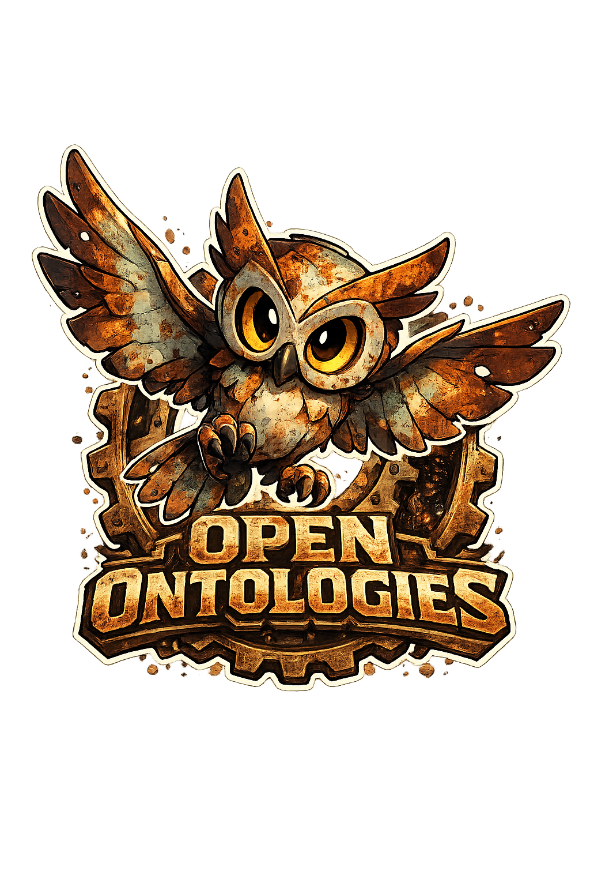
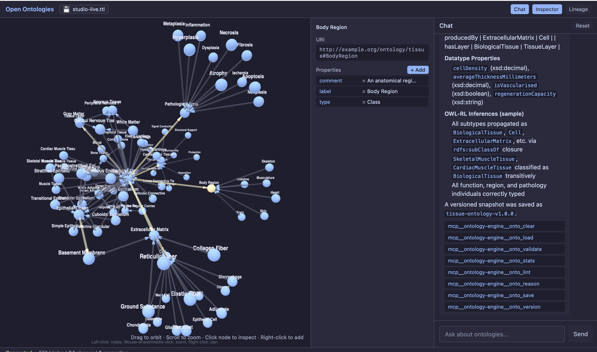
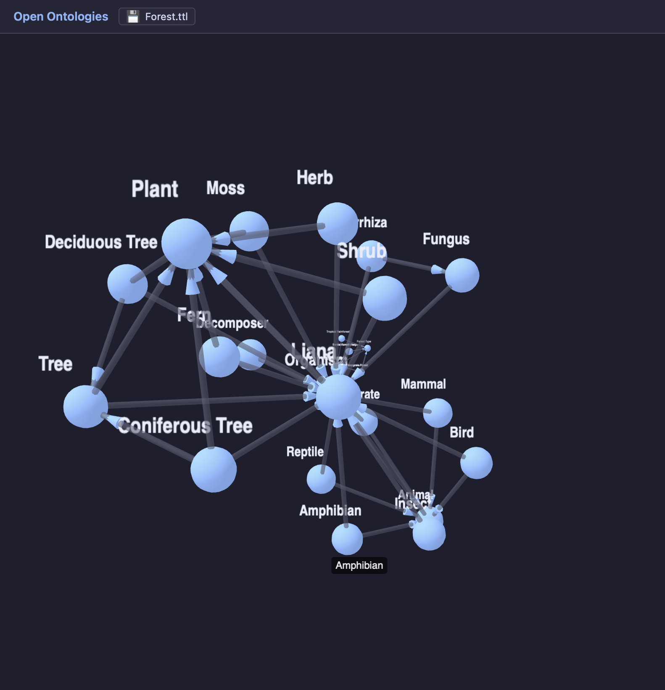

<!-- mcp-name: io.github.fabio-rovai/open-ontologies -->

<p align="center">
  
</p>

<!--
<h1 align="center">Open Ontologies</h1>
-->
<p align="center">
  <strong>A Terraforming MCP for Knowledge Graphs</strong><br>
  Validate, classify, and govern AI-generated ontologies. Written in Rust. Ships as a single binary.
</p>

<p align="center">
  <a href="https://github.com/fabio-rovai/open-ontologies/actions/workflows/ci.yml"></a>
  <a href="LICENSE"></a>
  <a href="https://openmcp.org/servers/open-ontologies"></a>
  <a href="https://www.pitchhut.com/project/open-ontologies-mcp"></a>
  <a href="https://clawhub.ai/fabio-rovai/open-ontologies"></a>
</p>

<p align="center">
  <a href="#quick-start-mcp--cli">Quick Start</a> ·
  <a href="#studio-desktop-app">Studio</a> ·
  <a href="#benchmarks">Benchmarks</a> ·
  <a href="#tools">Tools</a> ·
  <a href="#architecture">Architecture</a> ·
  <a href="#documentation">Docs</a>
</p>

---

Open Ontologies is a **Rust MCP server** and **desktop Studio** for AI-native ontology engineering. It exposes **42 tools** that let Claude build, validate, query, diff, lint, version, reason over, align, and persist RDF/OWL ontologies using an in-memory Oxigraph triple store — with Terraform-style lifecycle management, clinical crosswalks, semantic embeddings, and a full lineage audit trail.

The **Studio** wraps the engine in a visual desktop environment: 3D force-directed graph, AI chat panel, Protégé-style property inspector, and lineage viewer.

No JVM. No Protégé. No GUI required.

---

## Screenshots

| Full UI | 3D Graph |
|---|---|
|  |  |

*Forest ontology built entirely in natural language. Claude called `onto_clear` → `onto_load` → `onto_reason` → `onto_save` automatically.*

---

## Quick Start (MCP / CLI)

### Install

**Pre-built binaries:**

```bash
# macOS (Apple Silicon)
curl -LO https://github.com/fabio-rovai/open-ontologies/releases/latest/download/open-ontologies-aarch64-apple-darwin
chmod +x open-ontologies-aarch64-apple-darwin && mv open-ontologies-aarch64-apple-darwin /usr/local/bin/open-ontologies

# macOS (Intel)
curl -LO https://github.com/fabio-rovai/open-ontologies/releases/latest/download/open-ontologies-x86_64-apple-darwin
chmod +x open-ontologies-x86_64-apple-darwin && mv open-ontologies-x86_64-apple-darwin /usr/local/bin/open-ontologies

# Linux (x86_64)
curl -LO https://github.com/fabio-rovai/open-ontologies/releases/latest/download/open-ontologies-x86_64-unknown-linux-gnu
chmod +x open-ontologies-x86_64-unknown-linux-gnu && mv open-ontologies-x86_64-unknown-linux-gnu /usr/local/bin/open-ontologies
```

**Docker:**

```bash
docker pull ghcr.io/fabio-rovai/open-ontologies:latest
docker run -i ghcr.io/fabio-rovai/open-ontologies serve
```

**From source (Rust 1.85+):**

```bash
git clone https://github.com/fabio-rovai/open-ontologies.git
cd open-ontologies && cargo build --release
./target/release/open-ontologies init
```

### Connect to your MCP client

<details>
<summary><strong>Claude Code</strong></summary>

Add to `~/.claude/settings.json`:

```json
{
  "mcpServers": {
    "open-ontologies": {
      "command": "/path/to/open-ontologies/target/release/open-ontologies",
      "args": ["serve"]
    }
  }
}
```

Restart Claude Code. The `onto_*` tools are now available.
</details>

<details>
<summary><strong>Claude Desktop</strong></summary>

Add to `~/Library/Application Support/Claude/claude_desktop_config.json`:

```json
{
  "mcpServers": {
    "open-ontologies": {
      "command": "/path/to/open-ontologies/target/release/open-ontologies",
      "args": ["serve"]
    }
  }
}
```

</details>

<details>
<summary><strong>Cursor / Windsurf / any MCP-compatible IDE</strong></summary>

Add to `.cursor/mcp.json` or equivalent:

```json
{
  "mcpServers": {
    "open-ontologies": {
      "command": "/path/to/open-ontologies/target/release/open-ontologies",
      "args": ["serve"]
    }
  }
}
```

</details>

<details>
<summary><strong>Docker</strong></summary>

```json
{
  "mcpServers": {
    "open-ontologies": {
      "command": "docker",
      "args": ["run", "-i", "--rm", "ghcr.io/fabio-rovai/open-ontologies", "serve"]
    }
  }
}
```

</details>

### Build your first ontology

```text
Build me a Pizza ontology following the Manchester University tutorial.
Include all 49 toppings, 22 named pizzas, spiciness value partition,
and defined classes (VegetarianPizza, MeatyPizza, SpicyPizza).
Validate it, load it, and show me the stats.
```

Claude generates Turtle, then calls `onto_validate` → `onto_load` → `onto_stats` → `onto_lint` → `onto_query` automatically, fixing errors along the way.

---

## Studio (Desktop App)

The Studio lives in [`studio/`](studio/) — a Tauri 2 desktop app that provides a visual interface on top of the same engine.

**Prerequisites:** Rust + Cargo · Node.js 18+

```bash
# 1. Build the engine binary (from repo root)
cargo build --release

# 2. Install JS dependencies
cd studio && npm install

# 3. Run
PATH=/opt/homebrew/bin:~/.cargo/bin:$PATH npm run tauri dev
```

### Studio Features

| Feature | Description |
| --- | --- |
| **3D Graph Canvas** | Live force-directed OWL class hierarchy (Three.js / WebGL). Drag to orbit, scroll to zoom, click to inspect, right-click to add, Delete to remove. |
| **AI Agent Chat** | Natural language ontology engineering via Claude Sonnet 4.6 + Agent SDK. Type instructions — Claude calls the right tools automatically. |
| **Property Inspector** | Protégé-style inline triple editor. Click to edit, hover to delete, `+ Add` for new triples. |
| **Lineage Panel** | Full audit trail from SQLite: plan · apply · enforce · drift · monitor · align, grouped by session. |
| **Named Save** | ⌘S to save as `~/.open-ontologies/<name>.ttl`. Auto-saves to `studio-live.ttl` after every mutation. |

**Keyboard shortcuts:** `⌘J` chat · `⌘I` inspector · `⌘S` save · `Delete` remove node

---

## Benchmarks

### OntoAxiom — LLM Axiom Identification

[OntoAxiom](https://arxiv.org/abs/2512.05594) tests axiom identification across 9 ontologies and 3,042 ground truth axioms.

| Approach | F1 | vs o1 (paper best) |
| --- | --- | --- |
| o1 (paper's best) | 0.197 | — |
| Bare Claude Opus | 0.431 | **+119%** |
| **MCP extraction** | **0.717** | **+264%** |

### Pizza Ontology — Manchester Tutorial

One sentence input: *"Build a Pizza ontology following the Manchester tutorial specification."*

| Metric | Reference (Protégé, ~4 hours) | AI-Generated (~5 min) | Coverage |
| --- | --- | --- | --- |
| Classes | 99 | 95 | **96%** |
| Properties | 8 | 8 | **100%** |
| Toppings | 49 | 49 | **100%** |
| Named Pizzas | 24 | 24 | **100%** |

### Mushroom Classification — OWL Reasoning vs Expert Labels

**Dataset:** UCI Mushroom Dataset — 8,124 specimens classified by mycology experts.

| Metric | Result |
| --- | --- |
| Accuracy | **98.33%** |
| Recall (poisonous) | **100%** — zero toxic mushrooms missed |
| False negatives | **0** |
| Classification rules | 6 OWL axioms |

### Reasoning Performance — vs HermiT

**LUBM Scaling (load + reason cycle)**

| Axioms | Open Ontologies | HermiT | Speedup |
| --- | --- | --- | --- |
| 1,000 | 15ms | 112ms | **7.5×** |
| 5,000 | 14ms | 410ms | **29×** |
| 10,000 | 14ms | 1,200ms | **86×** |
| 50,000 | 15ms | 24,490ms | **1,633×** |

Full benchmark writeup: [docs/benchmarks.md](docs/benchmarks.md)

---

## Tools

42 tools organized by function — available as MCP tools (prefixed `onto_`) and CLI subcommands:

| Category | Tools | Purpose |
| --- | --- | --- |
| **Core** | `validate` `load` `save` `clear` `stats` `query` `diff` `lint` `convert` `status` | RDF/OWL validation, querying, and management |
| **Remote** | `pull` `push` `import-owl` | Fetch/push ontologies, resolve owl:imports |
| **Schema** | `import-schema` | PostgreSQL → OWL conversion |
| **Data** | `map` `ingest` `shacl` `reason` `extend` | Structured data → RDF pipeline |
| **Versioning** | `version` `history` `rollback` | Named snapshots and rollback |
| **Lifecycle** | `plan` `apply` `lock` `drift` `enforce` `monitor` `monitor-clear` `lineage` | Terraform-style change management |
| **Alignment** | `align` `align-feedback` | Cross-ontology class matching with self-calibrating confidence |
| **Clinical** | `crosswalk` `enrich` `validate-clinical` | ICD-10 / SNOMED / MeSH crosswalks |
| **Feedback** | `lint-feedback` `enforce-feedback` | Self-calibrating suppression |
| **Embeddings** | `embed` `search` `similarity` | Dual-space semantic search (text + Poincaré structural) |
| **Reasoning** | `reason` `dl_explain` `dl_check` | Native OWL2-DL SHOIQ tableaux reasoner |

---

## Architecture

### Engine


### Studio


### Design decisions

| Decision | Reason |
| --- | --- |
| UI reads use sessionless REST | No MCP session management needed for SPARQL queries or stats |
| UI writes use REST `/api/update` + `/api/save` | Avoids session lifecycle issues in the Tauri WebKit webview |
| Agent writes go through MCP `tools/call` | The Agent SDK manages its own MCP session; Claude needs the full tool set |
| Shared `Arc<GraphStore>` | All MCP sessions and REST handlers share the same in-memory triple store |
| Agent sidecar over stdin/stdout | Keeps Node.js isolated; Tauri manages the full lifecycle |

---

## Stack

| Layer | Tech |
| --- | --- |
| Engine language | Rust (edition 2024) — single binary, no JVM |
| Triple store | Oxigraph 0.4 — pure Rust RDF/SPARQL 1.1 engine |
| MCP protocol | rmcp — Streamable HTTP transport |
| State / lineage / feedback | SQLite (rusqlite) |
| Clinical crosswalks | Apache Arrow / Parquet |
| Embeddings runtime | tract-onnx — pure Rust ONNX (optional) |
| Desktop shell | Tauri 2 |
| Frontend | React 19, Vite 7, TypeScript 5.8, Tailwind CSS 4 |
| 3D graph | 3d-force-graph 1.79 (Three.js / WebGL) |
| UI state | Zustand 5 |
| AI agent | Claude Sonnet 4.6 via Agent SDK (Node.js sidecar) |

---

## Documentation

| Topic | Link |
| --- | --- |
| Quickstart | [docs/quickstart.md](docs/quickstart.md) |
| Data Pipeline | [docs/data-pipeline.md](docs/data-pipeline.md) |
| Ontology Lifecycle | [docs/lifecycle.md](docs/lifecycle.md) |
| Schema Alignment | [docs/alignment.md](docs/alignment.md) |
| OWL2-DL Reasoning | [docs/reasoning.md](docs/reasoning.md) |
| Semantic Embeddings | [docs/embeddings.md](docs/embeddings.md) |
| Clinical Crosswalks | [docs/clinical.md](docs/clinical.md) |
| Benchmarks | [docs/benchmarks.md](docs/benchmarks.md) |
| Contributing | [CONTRIBUTING.md](CONTRIBUTING.md) |
| Changelog | [CHANGELOG.md](CHANGELOG.md) |

---

## License

MIT

<a href="https://glama.ai/mcp/servers/fabio-rovai/open-ontologies"></a>
