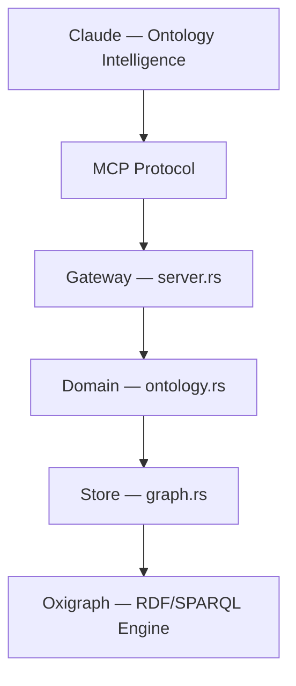

# Open Ontologies

AI-native ontology engine. Built with [OpenCheir](https://github.com/fabio-rovai/opencheir).

Claude is the ontology intelligence — it knows OWL, BORO, 4D modeling, every methodology. This engine handles what Claude physically cannot: RDF parsing, SPARQL execution, format conversion, and persistence.



## Tools

| Tool | Purpose |
| ---- | ------- |
| `onto_validate` | Validate RDF/OWL syntax (file or inline Turtle) |
| `onto_convert` | Convert between formats (Turtle, N-Triples, RDF/XML, N-Quads, TriG) |
| `onto_load` | Load RDF into in-memory graph store |
| `onto_query` | Run SPARQL queries against loaded ontology |
| `onto_save` | Save ontology store to file |
| `onto_stats` | Triple count, classes, properties, individuals |
| `onto_diff` | Compare two ontology files (added/removed triples) |
| `onto_lint` | Check for missing labels, comments, domains |
| `onto_clear` | Clear in-memory store |
| `onto_pull` | Fetch ontology from remote URL or SPARQL endpoint |
| `onto_push` | Push ontology to a SPARQL endpoint |
| `onto_import` | Resolve and load owl:imports chain |
| `onto_version` | Save a named snapshot of the current store |
| `onto_history` | List saved version snapshots |
| `onto_rollback` | Restore a previous version |

## Benchmarks

### Pizza Ontology (Manchester University Tutorial)

AI-generated vs the [canonical OWL tutorial](https://github.com/owlcs/pizza-ontology) — 99 classes, 8 properties, 2332 triples:

| Metric | Reference | AI-Generated | Coverage |
| ------ | --------- | ------------ | -------- |
| Classes | 99 | 95 | **96%** |
| Properties | 8 | 8 | **100%** |
| Toppings | 49 | 49 | **100%** |
| Named Pizzas | 24 | 24 | **100%** |
| Total triples | 2,332 | 1,168 | 50% size |

96% domain coverage in 50% of the triples. The 4 missing classes are teaching artifacts, not domain concepts. Traditional approach: ~4 hours in Protege. AI-native: ~5 minutes.

### IES4 Building Domain (BORO/4D)

Tested against the IES4 (UK Information Exchange Standard) building domain extension:

- **100% compliance** — 86/86 checks passed
- 318 triples, 36 classes, 12 properties
- Full 4D/BORO patterns: Entity+State pairs, BoundingStates, ClassOf
- All 9 competency questions covered
- Zero external tools — Claude generated the Turtle directly

### Run benchmarks

```bash
cd benchmark
python3 pizza_compare.py   # Pizza ontology comparison
python3 compare.py         # IES4 compliance check
```

## Stack

- **Rust** (edition 2024) — single binary, no JVM
- **Oxigraph** — pure Rust RDF/SPARQL engine
- **OpenCheir** — MCP server framework with enforcer, lineage, memory

## Install

Open Ontologies ships as part of OpenCheir:

```bash
git clone https://github.com/fabio-rovai/opencheir.git
cd opencheir
cargo build --release
```

Add to Claude Code (`~/.claude/settings.json`):

```json
{
  "mcpServers": {
    "opencheir": {
      "command": "/path/to/opencheir",
      "args": ["serve"]
    }
  }
}
```

## License

MIT
