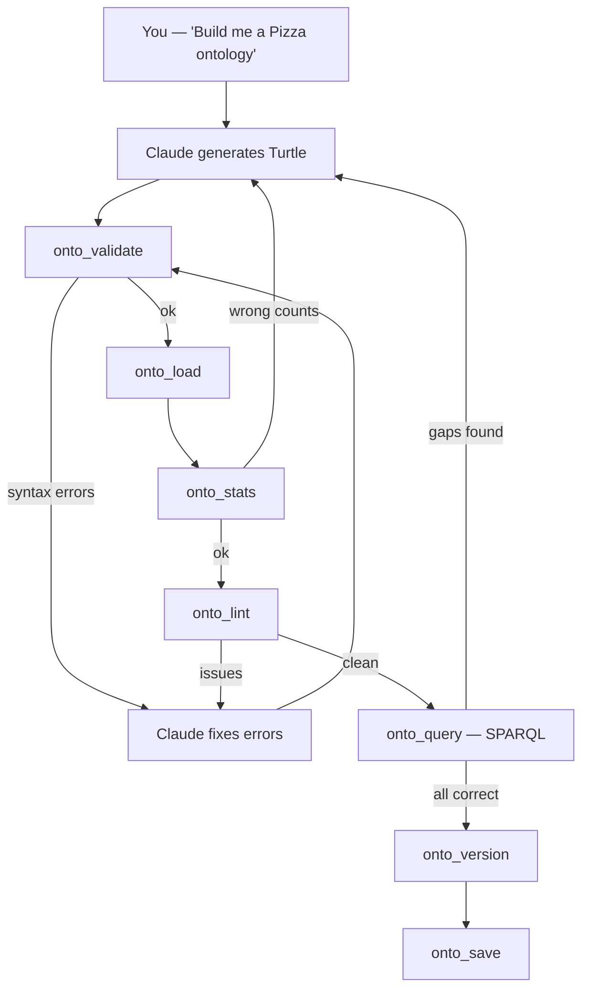
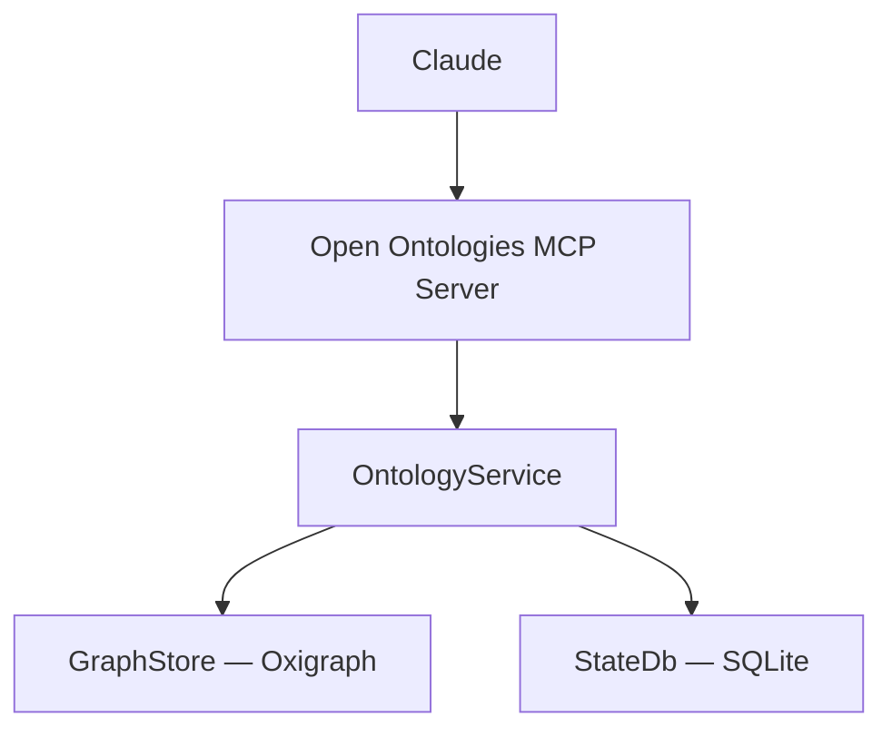

# Open Ontologies

AI-native ontology engine — build production ontologies in minutes instead of months.

## Why not just ask Claude directly?

You can ask Claude to generate an ontology in a single prompt — and it will. Claude knows OWL, RDF, BORO, 4D modeling, and every methodology from its training data. No fine-tuning, no plugins.

**But a single-shot generation has real problems:**

| Problem | What goes wrong |
| ------- | --------------- |
| No validation | Claude sometimes generates invalid Turtle — wrong prefixes, unclosed brackets, bad URIs. You won't know until you try to load it. |
| No verification | Did Claude actually produce 49 toppings or did it skip some? Without SPARQL, you're counting by hand. |
| No iteration | You can't diff what changed between versions. You can't lint for missing labels. You can't run competency questions as SPARQL. |
| No persistence | The ontology only lives in the chat context. Close the window, it's gone. No versioning, no rollback. |
| No scale | Claude's context window can hold ~2,000 triples. Real ontologies (IES4: 10,000+ triples) need an actual triple store. |
| No integration | You can't push to a SPARQL endpoint, pull from a remote ontology, or resolve owl:imports chains. |

**Open Ontologies solves every one of these.** It's a proper RDF/SPARQL engine (Oxigraph) exposed as 21 MCP tools that Claude calls automatically. Generate → validate → load → query → iterate → persist.

## What is it?

Open Ontologies is a standalone MCP server for AI-native ontology engineering. It exposes 21 tools that let Claude validate, query, diff, lint, version, and persist RDF/OWL ontologies using an in-memory Oxigraph triple store.

Written in Rust, ships as a single binary. No JVM, no Protege, no GUI.

**Optional companion:** [OpenCheir](https://github.com/fabio-rovai/opencheir) adds workflow enforcement, audit trails, and multi-agent orchestration. Its enforcer rules can govern ontology workflows (e.g., warn if saving without validating). But Open Ontologies works perfectly on its own.

## How it works

You provide domain requirements in natural language. Claude generates Turtle/OWL, then **dynamically decides** which MCP tools to call based on what each tool returns — validating, fixing, re-loading, querying, iterating until the ontology is correct.



This is not a fixed pipeline. The MCP server exposes 21 ontology tools — **Claude is the orchestrator** that decides what to call next based on results. If `onto_validate` fails, Claude fixes the Turtle and retries. If `onto_stats` shows wrong counts, Claude regenerates. If `onto_lint` finds missing labels, Claude adds them.

No Protege. No GUI. No manual class creation. Claude is the ontology engineer, Open Ontologies is the runtime.

The workflow is codified in two places so Claude follows it consistently:

- **[`CLAUDE.md`](CLAUDE.md)** — loaded automatically when you open Claude Code in this repo. Describes the generate → validate → verify → iterate → persist workflow.
- **[`/ontology-engineer` skill](skills/ontology-engineer.md)** — portable skill you can use from any project. Invoke it with `/ontology-engineer` in Claude Code.

### Architecture



## Tools

| Tool | Purpose |
| ---- | ------- |
| `onto_validate` | Validate RDF/OWL syntax (file or inline Turtle) |
| `onto_convert` | Convert between formats (Turtle, N-Triples, RDF/XML, N-Quads, TriG) |
| `onto_load` | Load RDF into in-memory graph store |
| `onto_query` | Run SPARQL queries against loaded ontology |
| `onto_save` | Save ontology store to file |
| `onto_stats` | Triple count, classes, properties, individuals |
| `onto_diff` | Compare two ontology files (added/removed triples) |
| `onto_lint` | Check for missing labels, comments, domains |
| `onto_clear` | Clear in-memory store |
| `onto_pull` | Fetch ontology from remote URL or SPARQL endpoint |
| `onto_push` | Push ontology to a SPARQL endpoint |
| `onto_import` | Resolve and load owl:imports chain |
| `onto_version` | Save a named snapshot of the current store |
| `onto_history` | List saved version snapshots |
| `onto_rollback` | Restore a previous version |
| `onto_status` | Server health and loaded triple count |
| `onto_ingest` | Parse structured data (CSV/JSON/XML/YAML/XLSX/Parquet) into RDF |
| `onto_map` | Generate mapping config from data schema + ontology |
| `onto_shacl` | Validate data against SHACL shapes |
| `onto_reason` | Run RDFS/OWL-RL inference (materialize triples) |
| `onto_extend` | Full pipeline: ingest → validate → reason |

## Benchmarks

### Pizza Ontology — Manchester University Tutorial

**Source:** The [Manchester Pizza Tutorial](https://www.michaeldebellis.com/post/new-protege-pizza-tutorial) is the most widely used OWL teaching material. Students build a Pizza ontology step-by-step in Protege over ~4 hours. The reference OWL file is [published on GitHub](https://github.com/owlcs/pizza-ontology).

**What the tutorial teaches (traditional approach):**

| Step | What you do in Protege | Time |
| ---- | ---------------------- | ---- |
| 1 | Create blank ontology, set IRI | 5 min |
| 2 | Add `Pizza`, `PizzaTopping`, `PizzaBase` classes via GUI | 10 min |
| 3 | Create `hasTopping`, `hasBase` object properties, set domains/ranges | 15 min |
| 4 | Add 49 topping subclasses (`MozzarellaTopping`, `HamTopping`, ...) one by one | 30 min |
| 5 | Add `hasSpiciness` property, create `Spiciness` value partition (`Hot`/`Medium`/`Mild`) | 15 min |
| 6 | Add spiciness restrictions to each topping class individually | 20 min |
| 7 | Make all sibling classes disjoint (click "Make siblings disjoint" per group) | 10 min |
| 8 | Create 24 named pizzas (`Margherita`, `American`, ...) with `someValuesFrom` restrictions | 45 min |
| 9 | Add closure axioms (`allValuesFrom`) to each named pizza | 30 min |
| 10 | Define `VegetarianPizza`, `MeatyPizza`, `SpicyPizza` as equivalent classes | 20 min |
| 11 | Run reasoner, debug, iterate | 20 min |

**Result:** 99 classes, 8 properties, 2,332 triples.

**What we did (AI-native approach):**

**Input to Claude:** One sentence — "Build a Pizza ontology following the Manchester tutorial specification." No custom prompts, no background documents, no examples. Claude knows the Pizza tutorial from its training data.

| Step | What you tell Claude | Tool used | Time |
| ---- | -------------------- | --------- | ---- |
| 1 | "Build a Pizza ontology following the Manchester tutorial spec" | Claude generates Turtle | 2 min |
| 2 | "Validate it" | `onto_validate` | 5 sec |
| 3 | "Load and check stats" | `onto_load` → `onto_stats` | 5 sec |
| 4 | "Lint it" | `onto_lint` | 5 sec |
| 5 | "Diff against the reference" | `onto_diff` | 5 sec |

**Result:** 95 classes, 8 properties, 1,168 triples. ~5 minutes total.

**Comparison:**

| Metric | Reference | AI-Generated | Coverage |
| ------ | --------- | ------------ | -------- |
| Classes | 99 | 95 | **96%** |
| Properties | 8 | 8 | **100%** |
| Toppings | 49 | 49 | **100%** |
| Named Pizzas | 24 | 24 | **100%** |
| Total triples | 2,332 | 1,168 | 50% size |

The 4 missing classes (`UnclosedPizza`, `SpicyPizzaEquivalent`, `VegetarianPizzaEquivalent1`, `VegetarianPizzaEquivalent2`) are teaching artifacts — they exist only to demonstrate OWL syntax variants in the tutorial, not actual domain concepts.

The AI produces 50% fewer triples because it uses compact `owl:AllDisjointClasses` declarations instead of exhaustive pairwise `owl:disjointWith` axioms (398 pairs in reference vs 101 in AI) — same semantics, fewer triples.

**Files:**

- Reference: [`benchmark/reference/pizza-reference.owl`](benchmark/reference/pizza-reference.owl) — the original Manchester OWL file (6,858 lines)
- AI-generated: [`benchmark/generated/pizza-ai.ttl`](benchmark/generated/pizza-ai.ttl) — Claude's Turtle output
- Comparison script: [`benchmark/pizza_compare.py`](benchmark/pizza_compare.py)
- Full comparison: [`benchmark/PIZZA_COMPARISON.md`](benchmark/PIZZA_COMPARISON.md)

### IES4 Building Domain — BORO/4D Methodology

**Source:** The [IES4 standard](https://github.com/dstl/IES4) is the UK government's Information Exchange Standard, built on BORO (Business Objects Reference Ontology) and 4D perdurantist modeling. It's a real-world upper ontology used in defence and intelligence.

**What an ontology engineer does (traditional approach):**

| Step | What you do | Time |
| ---- | ----------- | ---- |
| 1 | Read the IES4 spec (200+ pages), understand BORO/4D patterns | 2-3 days |
| 2 | Import IES4 upper ontology into Protege | 30 min |
| 3 | Create Entity+State pairs for each domain concept | 2-3 hours |
| 4 | Add BoundingStates, ClassOf hierarchies | 1-2 hours |
| 5 | Define properties linking states to entities | 1 hour |
| 6 | Write SHACL shapes for validation | 2-3 hours |
| 7 | Run validation against IES4 SHACL shapes | 30 min |
| 8 | Debug and iterate until compliant | 1-2 days |

**What we did (AI-native approach):**

**Input to Claude:** Three documents providing context (all included in [`benchmark/reference/`](benchmark/reference/)):

- [`background_prompt.txt`](benchmark/reference/background_prompt.txt) — explains BORO/4D methodology, perdurantism, mereotopology
- [`instructions.txt`](benchmark/reference/instructions.txt) — structural requirements: 4D Entity+State pattern, ClassOf hierarchies, property conventions
- [`custom_instructions.txt`](benchmark/reference/custom_instructions.txt) — the actual domain brief: UK building/energy performance, 9 competency questions

Claude reads these, then generates the complete Turtle file in one pass. Tools validate and verify.

**Result:**

- **100% compliance** — 86/86 checks passed
- 318 triples, 36 classes, 12 properties
- Full 4D/BORO patterns: Entity+State pairs, BoundingStates, ClassOf
- All 9 competency questions covered
- One-pass generation — Claude produced valid Turtle directly, tools validated afterward

**Files:**

- Reference upper ontology: [`benchmark/reference/ies4.ttl`](benchmark/reference/ies4.ttl) — the full IES4 standard (249K)
- Reference SHACL shapes: [`benchmark/reference/ies4.shacl`](benchmark/reference/ies4.shacl) — validation rules (106K)
- Reference instructions: [`benchmark/reference/instructions.txt`](benchmark/reference/instructions.txt) — the domain brief given to Claude
- AI-generated extension: [`benchmark/generated/ies-building-extension.ttl`](benchmark/generated/ies-building-extension.ttl) — Claude's output
- BORO handcrafted: [`benchmark/reference/boro-building-handcrafted.ttl`](benchmark/reference/boro-building-handcrafted.ttl) — traditional BORO for comparison
- BORO AI-generated: [`benchmark/generated/boro-building-ai.ttl`](benchmark/generated/boro-building-ai.ttl) — Claude's BORO version
- Compliance script: [`benchmark/compare.py`](benchmark/compare.py) — runs 86 checks
- BORO comparison script: [`benchmark/boro_compare.py`](benchmark/boro_compare.py)
- Full comparison: [`benchmark/BORO_COMPARISON.md`](benchmark/BORO_COMPARISON.md)

## Replicate it yourself

### 1. Build Open Ontologies

You need Rust 1.85+ (edition 2024).

```bash
git clone https://github.com/fabio-rovai/open-ontologies.git
cd open-ontologies
cargo build --release
./target/release/open-ontologies init
```

### 2. Connect to Claude Code

Add to `~/.claude/settings.json`:

```json
{
  "mcpServers": {
    "open-ontologies": {
      "command": "/path/to/open-ontologies/target/release/open-ontologies",
      "args": ["serve"]
    }
  }
}
```

Restart Claude Code. You should see the `onto_*` tools available.

### 3. (Optional) Add OpenCheir for governance

For workflow enforcement, audit trails, and multi-agent orchestration:

```json
{
  "mcpServers": {
    "open-ontologies": {
      "command": "/path/to/open-ontologies/target/release/open-ontologies",
      "args": ["serve"]
    },
    "opencheir": {
      "command": "/path/to/opencheir/target/release/opencheir",
      "args": ["serve"]
    }
  }
}
```

### 4. Build your first ontology

Open Claude Code and type:

```text
Build me a Pizza ontology following the Manchester University tutorial.
Include all 49 toppings, 22 named pizzas, spiciness value partition,
and defined classes (VegetarianPizza, MeatyPizza, SpicyPizza).
Validate it, load it, and show me the stats.
```

### 5. Try with your own domain

For a simple ontology (like Pizza), one sentence is enough. For complex methodologies (like BORO/4D), give Claude context:

```text
I need a building domain ontology following IES4/BORO patterns.
Here are the requirements: [paste your competency questions]
Use 4D Entity+State pairs, ClassOf hierarchies, and alphabetical ordering.
Validate it and run compliance checks.
```

### 6. Run the benchmarks

```bash
cd benchmark
pip install rdflib
python3 pizza_compare.py   # Pizza: 96% class coverage, 100% properties
python3 compare.py         # IES4: 86/86 compliance checks passed
```

## Stack

- **Rust** (edition 2024) — single binary, no JVM
- **Oxigraph 0.4** — pure Rust RDF/SPARQL engine
- **rmcp** — MCP protocol implementation
- **SQLite** — ontology version storage

## License

MIT
