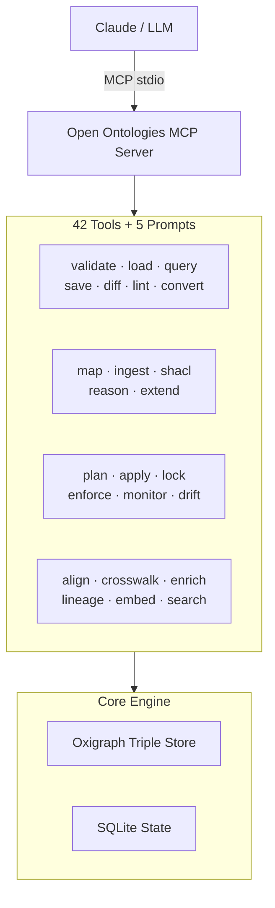

<!-- mcp-name: io.github.fabio-rovai/open-ontologies -->
# A Terraforming MCP for Knowledge Graphs: validate, classify, and govern AI-generated ontologies.

[](https://github.com/fabio-rovai/open-ontologies/actions/workflows/ci.yml)
[](LICENSE)
[](https://openmcp.org/servers/open-ontologies)
[](https://www.pitchhut.com/project/open-ontologies-mcp)
[](https://clawhub.ai/fabio-rovai/open-ontologies)


Open Ontologies is a standalone MCP server and CLI for AI-native ontology engineering. It exposes 42 tools and 5 workflow prompts that let Claude validate, query, diff, lint, version, and persist RDF/OWL ontologies using an in-memory Oxigraph triple store — plus plan changes, detect drift, enforce design patterns, monitor health, align ontologies, track lineage, and learn from user feedback.

Written in Rust, ships as a single binary. No JVM, no Protege, no GUI.

## Quick Start

### 1. Install

#### Pre-built binaries

Download from [GitHub Releases](https://github.com/fabio-rovai/open-ontologies/releases/latest):

```bash
# macOS (Apple Silicon)
curl -LO https://github.com/fabio-rovai/open-ontologies/releases/latest/download/open-ontologies-aarch64-apple-darwin
chmod +x open-ontologies-aarch64-apple-darwin && mv open-ontologies-aarch64-apple-darwin /usr/local/bin/open-ontologies

# macOS (Intel)
curl -LO https://github.com/fabio-rovai/open-ontologies/releases/latest/download/open-ontologies-x86_64-apple-darwin
chmod +x open-ontologies-x86_64-apple-darwin && mv open-ontologies-x86_64-apple-darwin /usr/local/bin/open-ontologies

# Linux (x86_64)
curl -LO https://github.com/fabio-rovai/open-ontologies/releases/latest/download/open-ontologies-x86_64-unknown-linux-gnu
chmod +x open-ontologies-x86_64-unknown-linux-gnu && mv open-ontologies-x86_64-unknown-linux-gnu /usr/local/bin/open-ontologies
```

#### Docker

```bash
docker pull ghcr.io/fabio-rovai/open-ontologies:latest
docker run -i ghcr.io/fabio-rovai/open-ontologies serve
```

#### From source (Rust 1.85+)

```bash
git clone https://github.com/fabio-rovai/open-ontologies.git
cd open-ontologies
cargo build --release
./target/release/open-ontologies init
```

### 2. Connect to your MCP client

<details>
<summary><strong>Claude Code</strong></summary>

Add to `~/.claude/settings.json`:

```json
{
  "mcpServers": {
    "open-ontologies": {
      "command": "/path/to/open-ontologies/target/release/open-ontologies",
      "args": ["serve"]
    }
  }
}
```

Restart Claude Code. The `onto_*` tools are now available.
</details>

<details>
<summary><strong>Claude Desktop</strong></summary>

Add to `~/Library/Application Support/Claude/claude_desktop_config.json` (macOS) or `%APPDATA%\Claude\claude_desktop_config.json` (Windows):

```json
{
  "mcpServers": {
    "open-ontologies": {
      "command": "/path/to/open-ontologies/target/release/open-ontologies",
      "args": ["serve"]
    }
  }
}
```
</details>

<details>
<summary><strong>Cursor / Windsurf / any MCP-compatible IDE</strong></summary>

Add to your MCP settings (usually `.cursor/mcp.json` or equivalent):

```json
{
  "mcpServers": {
    "open-ontologies": {
      "command": "/path/to/open-ontologies/target/release/open-ontologies",
      "args": ["serve"]
    }
  }
}
```
</details>

<details>
<summary><strong>Docker</strong></summary>

```json
{
  "mcpServers": {
    "open-ontologies": {
      "command": "docker",
      "args": ["run", "-i", "--rm", "ghcr.io/fabio-rovai/open-ontologies", "serve"]
    }
  }
}
```
</details>

### 3. Build your first ontology

```text
Build me a Pizza ontology following the Manchester University tutorial.
Include all 49 toppings, 22 named pizzas, spiciness value partition,
and defined classes (VegetarianPizza, MeatyPizza, SpicyPizza).
Validate it, load it, and show me the stats.
```

Claude generates Turtle, then automatically calls `onto_validate` → `onto_load` → `onto_stats` → `onto_lint` → `onto_query`, fixing errors along the way.

## Why This Exists

Single-shot LLM ontology generation has real problems: no validation, no verification, no iteration, no persistence, no scale, no integration. Open Ontologies solves all of these with a proper RDF/SPARQL engine (Oxigraph) exposed as MCP tools that Claude calls automatically.

## Tools

42 tools organized by function:

| Category | Tools | Purpose |
| -------- | ----- | ------- |
| **Core** | `validate`, `load`, `save`, `clear`, `stats`, `query`, `diff`, `lint`, `convert`, `status` | RDF/OWL validation, querying, and management |
| **Remote** | `pull`, `push`, `import-owl` | Fetch/push ontologies, resolve owl:imports |
| **Schema** | `import-schema` | PostgreSQL → OWL conversion |
| **Data** | `map`, `ingest`, `shacl`, `reason`, `extend` | Structured data → RDF pipeline |
| **Versioning** | `version`, `history`, `rollback` | Named snapshots and rollback |
| **Lifecycle** | `plan`, `apply`, `lock`, `drift`, `enforce`, `monitor`, `monitor-clear`, `lineage` | Terraform-style change management |
| **Alignment** | `align`, `align-feedback` | Cross-ontology class matching with self-calibrating confidence |
| **Clinical** | `crosswalk`, `enrich`, `validate-clinical` | ICD-10 / SNOMED / MeSH crosswalks |
| **Feedback** | `lint-feedback`, `enforce-feedback` | Self-calibrating suppression |
| **Embeddings** | `embed`, `search`, `similarity` | Dual-space semantic search (text + Poincare structural) |
| **Reasoning** | `reason`, `dl_explain`, `dl_check` | Native OWL2-DL SHOIQ tableaux reasoner |

All tools are available both as MCP tools (prefixed `onto_`) and as CLI subcommands.

## Architecture



## Documentation

| Topic | Link |
| ----- | ---- |
| Quickstart | [docs/quickstart.md](docs/quickstart.md) |
| Data Pipeline | [docs/data-pipeline.md](docs/data-pipeline.md) |
| Ontology Lifecycle | [docs/lifecycle.md](docs/lifecycle.md) |
| Schema Alignment | [docs/alignment.md](docs/alignment.md) |
| OWL2-DL Reasoning | [docs/reasoning.md](docs/reasoning.md) |
| Semantic Embeddings | [docs/embeddings.md](docs/embeddings.md) |
| Clinical Crosswalks | [docs/clinical.md](docs/clinical.md) |
| Benchmarks | [docs/benchmarks.md](docs/benchmarks.md) |
| Contributing | [CONTRIBUTING.md](CONTRIBUTING.md) |
| Changelog | [CHANGELOG.md](CHANGELOG.md) |

## Stack

- **Rust** (edition 2024) — single binary, no JVM
- **Oxigraph 0.4** — pure Rust RDF/SPARQL engine
- **rmcp** — MCP protocol implementation
- **SQLite** (rusqlite) — state, versions, lineage, feedback, embeddings
- **Apache Arrow/Parquet** — clinical crosswalk file format
- **tract-onnx** — pure Rust ONNX runtime for text embeddings (optional)
- **tokenizers** — HuggingFace tokenizer (optional)

## License

MIT

<a href="https://glama.ai/mcp/servers/fabio-rovai/open-ontologies"></a>
