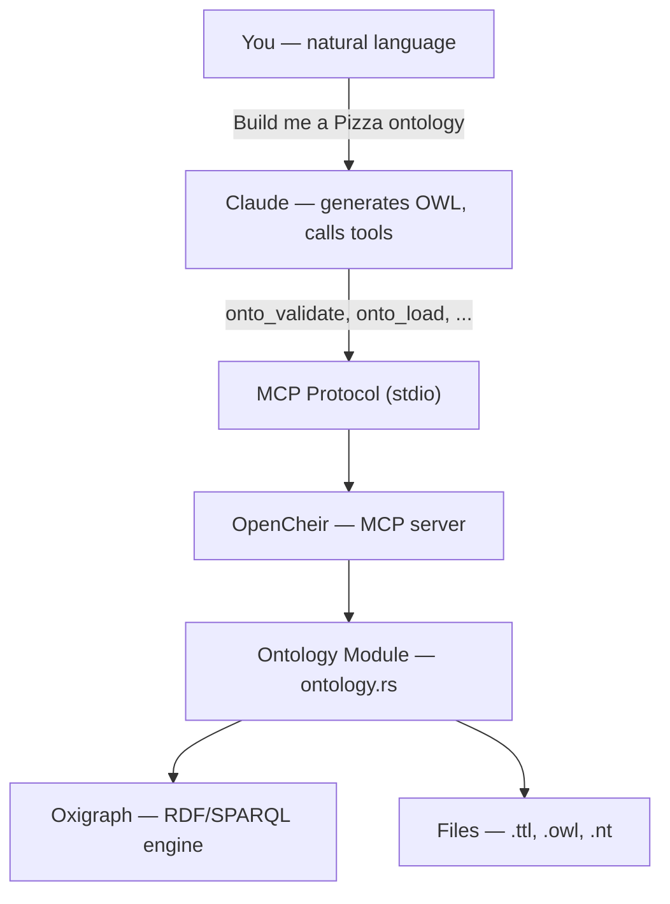

# Open Ontologies

AI-native ontology engine — build production ontologies in minutes instead of months.

## What is it?

Open Ontologies is an [MCP server](https://modelcontextprotocol.io/) that gives Claude the ability to work with ontologies end-to-end. It runs as a module inside [OpenCheir](https://github.com/fabio-rovai/opencheir), which exposes 15 `onto_*` tools via the Model Context Protocol.

**The idea:** Claude already knows OWL, RDF, BORO, 4D modeling, and every ontology methodology from its training data. It can generate valid Turtle/OWL directly. But it can't parse RDF files, execute SPARQL queries, or persist triples. Open Ontologies handles the parts Claude physically cannot do.

## How it works

There are no special skills, plugins, or fine-tuning. Claude's ontology knowledge is native — it learned OWL, RDF, SPARQL, and methodologies like BORO from public standards, tutorials, and academic literature during training.

You provide two things:

1. **Domain requirements** — what you want to model, in natural language (e.g. "build a Pizza ontology" or a requirements doc with competency questions)
2. **Methodology guidance** (optional) — if you need a specific approach like BORO/4D patterns, tell Claude or provide a background prompt

Claude generates the Turtle/OWL directly, then uses the MCP tools to validate and persist it:

```text
You: "Build me a Pizza ontology with 49 toppings and 22 named pizzas"
                    │
                    ▼
        Claude generates Turtle (from its training knowledge)
                    │
                    ▼
        onto_validate ──→ checks OWL syntax
        onto_load     ──→ loads into in-memory store
        onto_stats    ──→ 95 classes, 8 properties
        onto_lint     ──→ checks labels, domains, ranges
        onto_query    ──→ runs SPARQL to verify structure
        onto_save     ──→ persists to file
```

No Protege. No GUI. No manual class creation. No skills or plugins. Claude is the ontology engineer, Open Ontologies is the toolkit.



## Tools

| Tool | Purpose |
| ---- | ------- |
| `onto_validate` | Validate RDF/OWL syntax (file or inline Turtle) |
| `onto_convert` | Convert between formats (Turtle, N-Triples, RDF/XML, N-Quads, TriG) |
| `onto_load` | Load RDF into in-memory graph store |
| `onto_query` | Run SPARQL queries against loaded ontology |
| `onto_save` | Save ontology store to file |
| `onto_stats` | Triple count, classes, properties, individuals |
| `onto_diff` | Compare two ontology files (added/removed triples) |
| `onto_lint` | Check for missing labels, comments, domains |
| `onto_clear` | Clear in-memory store |
| `onto_pull` | Fetch ontology from remote URL or SPARQL endpoint |
| `onto_push` | Push ontology to a SPARQL endpoint |
| `onto_import` | Resolve and load owl:imports chain |
| `onto_version` | Save a named snapshot of the current store |
| `onto_history` | List saved version snapshots |
| `onto_rollback` | Restore a previous version |

## Benchmarks

### Pizza Ontology — Manchester University Tutorial

**Source:** The [Manchester Pizza Tutorial](https://www.michaeldebellis.com/post/new-protege-pizza-tutorial) is the most widely used OWL teaching material. Students build a Pizza ontology step-by-step in Protege over ~4 hours. The reference OWL file is [published on GitHub](https://github.com/owlcs/pizza-ontology).

**What the tutorial teaches (traditional approach):**

| Step | What you do in Protege | Time |
| ---- | ---------------------- | ---- |
| 1 | Create blank ontology, set IRI | 5 min |
| 2 | Add `Pizza`, `PizzaTopping`, `PizzaBase` classes via GUI | 10 min |
| 3 | Create `hasTopping`, `hasBase` object properties, set domains/ranges | 15 min |
| 4 | Add 49 topping subclasses (`MozzarellaTopping`, `HamTopping`, ...) one by one | 30 min |
| 5 | Add `hasSpiciness` property, create `Spiciness` value partition (`Hot`/`Medium`/`Mild`) | 15 min |
| 6 | Add spiciness restrictions to each topping class individually | 20 min |
| 7 | Make all sibling classes disjoint (click "Make siblings disjoint" per group) | 10 min |
| 8 | Create 22 named pizzas (`Margherita`, `American`, ...) with `someValuesFrom` restrictions | 45 min |
| 9 | Add closure axioms (`allValuesFrom`) to each named pizza | 30 min |
| 10 | Define `VegetarianPizza`, `MeatyPizza`, `SpicyPizza` as equivalent classes | 20 min |
| 11 | Run reasoner, debug, iterate | 20 min |

**Result:** 99 classes, 8 properties, 2,332 triples.

**What we did (AI-native approach):**

**Input to Claude:** One sentence — "Build a Pizza ontology following the Manchester tutorial specification." No custom prompts, no background documents, no examples. Claude knows the Pizza tutorial from its training data.

| Step | What you tell Claude | Tool used | Time |
| ---- | -------------------- | --------- | ---- |
| 1 | "Build a Pizza ontology following the Manchester tutorial spec" | Claude generates Turtle | 2 min |
| 2 | "Validate it" | `onto_validate` | 5 sec |
| 3 | "Load and check stats" | `onto_load` → `onto_stats` | 5 sec |
| 4 | "Lint it" | `onto_lint` | 5 sec |
| 5 | "Diff against the reference" | `onto_diff` | 5 sec |

**Result:** 95 classes, 8 properties, 1,168 triples. ~5 minutes total.

**Comparison:**

| Metric | Reference | AI-Generated | Coverage |
| ------ | --------- | ------------ | -------- |
| Classes | 99 | 95 | **96%** |
| Properties | 8 | 8 | **100%** |
| Toppings | 49 | 49 | **100%** |
| Named Pizzas | 24 | 24 | **100%** |
| Total triples | 2,332 | 1,168 | 50% size |

The 4 missing classes (`UnclosedPizza`, `SpicyPizzaEquivalent`, `VegetarianPizzaEquivalent1`, `VegetarianPizzaEquivalent2`) are teaching artifacts — they exist only to demonstrate OWL syntax variants in the tutorial, not actual domain concepts.

The AI produces 50% fewer triples because it skips exhaustive pairwise disjointness declarations (398 pairs in reference vs 101 in AI) — mechanical axioms that a reasoner can infer from the hierarchy.

**Files:**

- Reference: [`benchmark/reference/pizza-reference.owl`](benchmark/reference/pizza-reference.owl) — the original Manchester OWL file (6,858 lines)
- AI-generated: [`benchmark/generated/pizza-ai.ttl`](benchmark/generated/pizza-ai.ttl) — Claude's Turtle output
- Comparison script: [`benchmark/pizza_compare.py`](benchmark/pizza_compare.py)
- Full comparison: [`benchmark/PIZZA_COMPARISON.md`](benchmark/PIZZA_COMPARISON.md)

### IES4 Building Domain — BORO/4D Methodology

**Source:** The [IES4 standard](https://github.com/dstl/IES4) is the UK government's Information Exchange Standard, built on BORO (Business Objects Reference Ontology) and 4D perdurantist modeling. It's a real-world upper ontology used in defence and intelligence.

**What an ontology engineer does (traditional approach):**

| Step | What you do | Time |
| ---- | ----------- | ---- |
| 1 | Read the IES4 spec (200+ pages), understand BORO/4D patterns | 2-3 days |
| 2 | Import IES4 upper ontology into Protege | 30 min |
| 3 | Create Entity+State pairs for each domain concept | 2-3 hours |
| 4 | Add BoundingStates, ClassOf hierarchies | 1-2 hours |
| 5 | Define properties linking states to entities | 1 hour |
| 6 | Write SHACL shapes for validation | 2-3 hours |
| 7 | Run validation against IES4 SHACL shapes | 30 min |
| 8 | Debug and iterate until compliant | 1-2 days |

**What we did (AI-native approach):**

**Input to Claude:** Three documents providing context (all included in [`benchmark/reference/`](benchmark/reference/)):
c- Zero external tools — Claude generated the Turtle directly

**Files:**

- Reference upper ontology: [`benchmark/reference/ies4.ttl`](benchmark/reference/ies4.ttl) — the full IES4 standard (249K)
- Reference SHACL shapes: [`benchmark/reference/ies4.shacl`](benchmark/reference/ies4.shacl) — validation rules (106K)
- Reference instructions: [`benchmark/reference/instructions.txt`](benchmark/reference/instructions.txt) — the domain brief given to Claude
- AI-generated extension: [`benchmark/generated/ies-building-extension.ttl`](benchmark/generated/ies-building-extension.ttl) — Claude's output
- BORO handcrafted: [`benchmark/reference/boro-building-handcrafted.ttl`](benchmark/reference/boro-building-handcrafted.ttl) — traditional BORO for comparison
- BORO AI-generated: [`benchmark/generated/boro-building-ai.ttl`](benchmark/generated/boro-building-ai.ttl) — Claude's BORO version
- Compliance script: [`benchmark/compare.py`](benchmark/compare.py) — runs 86 checks
- BORO comparison script: [`benchmark/boro_compare.py`](benchmark/boro_compare.py)
- Full comparison: [`benchmark/BORO_COMPARISON.md`](benchmark/BORO_COMPARISON.md)

## Replicate it yourself

### 1. Install OpenCheir

Open Ontologies runs inside [OpenCheir](https://github.com/fabio-rovai/opencheir). You need Rust 1.80+.

```bash
git clone https://github.com/fabio-rovai/opencheir.git
cd opencheir
cargo build --release
```

### 2. Connect to Claude Code

Add to `~/.claude/settings.json`:

```json
{
  "mcpServers": {
    "opencheir": {
      "command": "/path/to/opencheir/target/release/opencheir",
      "args": ["serve"]
    }
  }
}
```

Restart Claude Code. You should see the `onto_*` tools available.

### 3. Build your first ontology

Open Claude Code and type:

```text
Build me a Pizza ontology following the Manchester University tutorial.
Include all 49 toppings, 22 named pizzas, spiciness value partition,
and defined classes (VegetarianPizza, MeatyPizza, SpicyPizza).
Validate it, load it, and show me the stats.
```

Claude will:

1. Generate the complete Turtle file (~600 lines)
2. Call `onto_validate` to check OWL syntax
3. Call `onto_load` to load it into the in-memory store
4. Call `onto_stats` to show you: 95 classes, 8 properties, 1168 triples

That's it. No Protege, no GUI, no manual class creation.

### 4. Try with your own domain

For a simple ontology (like Pizza), one sentence is enough. For complex methodologies (like BORO/4D), give Claude context:

```text
I need a building domain ontology following IES4/BORO patterns.
Here are the requirements: [paste your competency questions]
Use 4D Entity+State pairs, ClassOf hierarchies, and alphabetical ordering.
Validate it and run compliance checks.
```

Or point Claude at a requirements document — it can read files directly.

### 5. Run the benchmarks

To verify the comparison results yourself:

```bash
cd benchmark
pip install rdflib
python3 pizza_compare.py   # Pizza: 96% class coverage, 100% properties
python3 compare.py         # IES4: 86/86 compliance checks passed
```

## Stack

- **Rust** (edition 2024) — single binary, no JVM
- **Oxigraph** — pure Rust RDF/SPARQL engine
- **OpenCheir** — MCP server framework with enforcer, lineage, memory

## License

MIT
