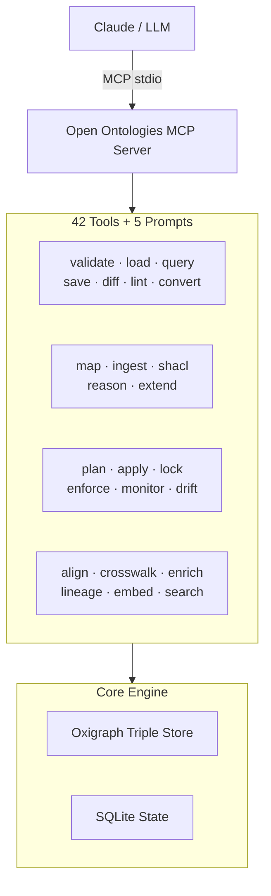

<!-- mcp-name: io.github.fabio-rovai/open-ontologies -->
# Open Ontologies

[](https://github.com/fabio-rovai/open-ontologies/actions/workflows/ci.yml)
[](LICENSE)
[](https://openmcp.org/servers/open-ontologies)
[](https://www.pitchhut.com/project/open-ontologies-mcp)
[](https://clawhub.ai/fabio-rovai/open-ontologies)

A Terraforming MCP for Knowledge Graphs: validate, classify, and govern AI-generated ontologies.

Open Ontologies is a standalone MCP server and CLI for AI-native ontology engineering. It exposes 42 tools and 5 workflow prompts that let Claude validate, query, diff, lint, version, and persist RDF/OWL ontologies using an in-memory Oxigraph triple store — plus plan changes, detect drift, enforce design patterns, monitor health, align ontologies, track lineage, and learn from user feedback.

Written in Rust, ships as a single binary. No JVM, no Protégé, no GUI.

---

## Contents

- [MCP Server / CLI](#quick-start) — use Open Ontologies from Claude Code, Claude Desktop, or any MCP client
- [Studio](#studio) — desktop GUI for visual ontology engineering (Tauri + React + 3D graph)

---

## Quick Start

### 1. Install

#### Pre-built binaries

Download from [GitHub Releases](https://github.com/fabio-rovai/open-ontologies/releases/latest):

```bash
# macOS (Apple Silicon)
curl -LO https://github.com/fabio-rovai/open-ontologies/releases/latest/download/open-ontologies-aarch64-apple-darwin
chmod +x open-ontologies-aarch64-apple-darwin && mv open-ontologies-aarch64-apple-darwin /usr/local/bin/open-ontologies

# macOS (Intel)
curl -LO https://github.com/fabio-rovai/open-ontologies/releases/latest/download/open-ontologies-x86_64-apple-darwin
chmod +x open-ontologies-x86_64-apple-darwin && mv open-ontologies-x86_64-apple-darwin /usr/local/bin/open-ontologies

# Linux (x86_64)
curl -LO https://github.com/fabio-rovai/open-ontologies/releases/latest/download/open-ontologies-x86_64-unknown-linux-gnu
chmod +x open-ontologies-x86_64-unknown-linux-gnu && mv open-ontologies-x86_64-unknown-linux-gnu /usr/local/bin/open-ontologies
```

#### Docker

```bash
docker pull ghcr.io/fabio-rovai/open-ontologies:latest
docker run -i ghcr.io/fabio-rovai/open-ontologies serve
```

#### From source (Rust 1.85+)

```bash
git clone https://github.com/fabio-rovai/open-ontologies.git
cd open-ontologies
cargo build --release
./target/release/open-ontologies init
```

### 2. Connect to your MCP client

<details>
<summary><strong>Claude Code</strong></summary>

Add to `~/.claude/settings.json`:

```json
{
  "mcpServers": {
    "open-ontologies": {
      "command": "/path/to/open-ontologies/target/release/open-ontologies",
      "args": ["serve"]
    }
  }
}
```

Restart Claude Code. The `onto_*` tools are now available.
</details>

<details>
<summary><strong>Claude Desktop</strong></summary>

Add to `~/Library/Application Support/Claude/claude_desktop_config.json` (macOS) or `%APPDATA%\Claude\claude_desktop_config.json` (Windows):

```json
{
  "mcpServers": {
    "open-ontologies": {
      "command": "/path/to/open-ontologies/target/release/open-ontologies",
      "args": ["serve"]
    }
  }
}
```
</details>

<details>
<summary><strong>Cursor / Windsurf / any MCP-compatible IDE</strong></summary>

Add to your MCP settings (usually `.cursor/mcp.json` or equivalent):

```json
{
  "mcpServers": {
    "open-ontologies": {
      "command": "/path/to/open-ontologies/target/release/open-ontologies",
      "args": ["serve"]
    }
  }
}
```
</details>

<details>
<summary><strong>Docker</strong></summary>

```json
{
  "mcpServers": {
    "open-ontologies": {
      "command": "docker",
      "args": ["run", "-i", "--rm", "ghcr.io/fabio-rovai/open-ontologies", "serve"]
    }
  }
}
```
</details>

### 3. Build your first ontology

```text
Build me a Pizza ontology following the Manchester University tutorial.
Include all 49 toppings, 22 named pizzas, spiciness value partition,
and defined classes (VegetarianPizza, MeatyPizza, SpicyPizza).
Validate it, load it, and show me the stats.
```

Claude generates Turtle, then automatically calls `onto_validate` → `onto_load` → `onto_stats` → `onto_lint` → `onto_query`, fixing errors along the way.

## Why This Exists

Single-shot LLM ontology generation has real problems: no validation, no verification, no iteration, no persistence, no scale, no integration. Open Ontologies solves all of these with a proper RDF/SPARQL engine (Oxigraph) exposed as MCP tools that Claude calls automatically.

## Tools

42 tools organized by function:

| Category | Tools | Purpose |
| -------- | ----- | ------- |
| **Core** | `validate`, `load`, `save`, `clear`, `stats`, `query`, `diff`, `lint`, `convert`, `status` | RDF/OWL validation, querying, and management |
| **Remote** | `pull`, `push`, `import-owl` | Fetch/push ontologies, resolve owl:imports |
| **Schema** | `import-schema` | PostgreSQL → OWL conversion |
| **Data** | `map`, `ingest`, `shacl`, `reason`, `extend` | Structured data → RDF pipeline |
| **Versioning** | `version`, `history`, `rollback` | Named snapshots and rollback |
| **Lifecycle** | `plan`, `apply`, `lock`, `drift`, `enforce`, `monitor`, `monitor-clear`, `lineage` | Terraform-style change management |
| **Alignment** | `align`, `align-feedback` | Cross-ontology class matching with self-calibrating confidence |
| **Clinical** | `crosswalk`, `enrich`, `validate-clinical` | ICD-10 / SNOMED / MeSH crosswalks |
| **Feedback** | `lint-feedback`, `enforce-feedback` | Self-calibrating suppression |
| **Embeddings** | `embed`, `search`, `similarity` | Dual-space semantic search (text + Poincare structural) |
| **Reasoning** | `reason`, `dl_explain`, `dl_check` | Native OWL2-DL SHOIQ tableaux reasoner |

All tools are available both as MCP tools (prefixed `onto_`) and as CLI subcommands.

## Architecture



## Documentation

| Topic | Link |
| ----- | ---- |
| Quickstart | [docs/quickstart.md](docs/quickstart.md) |
| Data Pipeline | [docs/data-pipeline.md](docs/data-pipeline.md) |
| Ontology Lifecycle | [docs/lifecycle.md](docs/lifecycle.md) |
| Schema Alignment | [docs/alignment.md](docs/alignment.md) |
| OWL2-DL Reasoning | [docs/reasoning.md](docs/reasoning.md) |
| Semantic Embeddings | [docs/embeddings.md](docs/embeddings.md) |
| Clinical Crosswalks | [docs/clinical.md](docs/clinical.md) |
| Benchmarks | [docs/benchmarks.md](docs/benchmarks.md) |
| Contributing | [CONTRIBUTING.md](CONTRIBUTING.md) |
| Changelog | [CHANGELOG.md](CHANGELOG.md) |

## Stack

- **Rust** (edition 2024) — single binary, no JVM
- **Oxigraph 0.4** — pure Rust RDF/SPARQL engine
- **rmcp** — MCP protocol implementation
- **SQLite** (rusqlite) — state, versions, lineage, feedback, embeddings
- **Apache Arrow/Parquet** — clinical crosswalk file format
- **tract-onnx** — pure Rust ONNX runtime for text embeddings (optional)
- **tokenizers** — HuggingFace tokenizer (optional)

## License

MIT

<a href="https://glama.ai/mcp/servers/fabio-rovai/open-ontologies"></a>

---

## Studio

A desktop ontology engineering environment powered by AI. Built with Tauri 2, React 19, and the Open Ontologies engine.

### Features

#### 3D Graph Canvas

The graph view renders your OWL ontology as a live 3D force-directed graph powered by `3d-force-graph` (Three.js / WebGL).

**How it works:**

- On connection, the canvas fires two SPARQL queries against the engine's in-memory Oxigraph store:
  - `SELECT ?c ?label WHERE { ?c a owl:Class . OPTIONAL { ?c rdfs:label ?label } }` — fetches all named classes
  - `SELECT ?sub ?parent WHERE { ?sub rdfs:subClassOf ?parent . ?sub a owl:Class }` — fetches the subclass hierarchy
- Nodes are spheres with floating canvas-text label sprites. The selected node is highlighted in amber; others are blue.
- Edges are directed arrows (subClassOf → parent direction) with 60% opacity.
- The graph uses Three.js warm lighting (ambient + directional) on a `#1e1e2e` background.
- A `ResizeObserver` keeps the canvas sized to its container on every layout change.

**Interaction:**

- **Drag** to orbit the scene
- **Scroll** to zoom in/out
- **Click a node** — selects it, flies the camera toward it (800ms ease), and opens the Property Inspector
- **Click background** — deselects
- **Right-click** — opens the Add Class dialog at the cursor position
- **Delete / Backspace** — deletes the selected class (fires two SPARQL DELETE statements, then saves and refreshes)

**Refresh:** After any mutation (agent, inspector, delete, add), `window.__refreshGraph()` is called to re-query the store and redraw.

#### AI Agent Chat

Natural language ontology engineering via the Claude Agent SDK.

**How it works:**
- The agent runs as a Node.js sidecar process (`studio/src-tauri/sidecars/agent/`), spawned by Tauri 3 seconds after the engine starts.
- The sidecar connects Claude to the Open Ontologies engine via its MCP endpoint (`http://localhost:8080/mcp`), giving Claude access to all 42 ontology tools.
- The Tauri Rust backend communicates with the sidecar over stdin/stdout using a simple JSON protocol (`{ type: 'chat', message }` in, `{ type: 'text' | 'tool_call' | 'done' | 'error' }` out).
- Multi-turn sessions are maintained in-memory within the sidecar process.
- After any mutation tool call, the frontend detects `mutated: true` in the `done` message and triggers a graph refresh.

**Slash commands:** `/build`, `/expand`, `/validate`, `/reason`, `/query`, `/stats`, `/save`

#### Property Inspector

Protégé-style property editing for any selected node.

- Click any literal or URI value to edit it inline (Enter saves, Escape cancels)
- Hover over a triple row to reveal the `×` delete button
- The `+ Add` button opens a form with predicate quick-pick and Literal/URI toggle
- All edits call SPARQL UPDATE via REST, then save to file

#### Lineage Panel

Full audit trail of every agent action, stored in SQLite and exposed via `GET /api/lineage`.

- Events grouped by session with a count badge
- Color-coded operation badges: `P` plan, `A` apply, `E` enforce, `D` drift, `M` monitor, `AL` align

#### Named Save

- Click `💾` or press **⌘S** to save with a custom filename
- Saves to `~/.open-ontologies/<name>.ttl`
- All auto-saves after mutations persist to `~/.open-ontologies/studio-live.ttl`

### Studio Architecture

```text
React UI (Vite + Tailwind)
  └── Tauri 2 shell
        ├── Engine sidecar  →  open-ontologies (Rust/Axum/Oxigraph)
        │     ├── /mcp              MCP Streamable HTTP
        │     ├── /api/stats        GET  — graph statistics
        │     ├── /api/query        POST — SPARQL SELECT
        │     ├── /api/update       POST — SPARQL UPDATE
        │     ├── /api/load         POST — load TTL file
        │     ├── /api/save         POST — save store to file
        │     ├── /api/load-turtle  POST — load inline Turtle
        │     └── /api/lineage      GET  — lineage events from SQLite
        └── Agent sidecar   →  Node.js (Claude Agent SDK)
              ├── stdin:  { type: 'chat', message } / { type: 'reset' }
              └── stdout: { type: 'text' | 'tool_call' | 'done' | 'error' | 'session' }
```

| Decision | Reason |
| --- | --- |
| Reads go through sessionless REST API | No MCP session management needed for SPARQL queries or stats |
| UI writes use REST `/api/update` + `/api/save` | Avoids session lifecycle issues in the Tauri WebKit webview |
| Agent writes go through MCP `tools/call` | The Agent SDK manages its own MCP session; Claude needs the full tool set |
| Shared `Arc<GraphStore>` | All MCP sessions and all REST handlers operate on the same in-memory triple store |
| Agent sidecar over stdin/stdout | Keeps Node.js process isolated; Tauri manages lifecycle |

### Studio Stack

| Layer | Tech |
| --- | --- |
| Desktop shell | Tauri 2 |
| Frontend | React 19, Vite 7, TypeScript 5.8, Tailwind CSS 4 |
| 3D graph | 3d-force-graph 1.79 (Three.js / WebGL) |
| State | Zustand 5 |
| Engine | Rust, Axum 0.8, Oxigraph 0.4 (SPARQL), SQLite |
| MCP | rmcp 1 (Streamable HTTP transport) |
| AI agent | Claude Sonnet 4.6 via Agent SDK (Node.js sidecar) |

### Running the Studio

#### Prerequisites

- **Rust + Cargo** — install via `curl https://sh.rustup.rs -sSf | sh`
- **Node.js 18+** — install via Homebrew: `brew install node`
- **Tauri CLI** — installed as a dev dependency (`npm install` handles this)

#### First-time setup

```bash
# 1. Build the engine binary
cargo build --release
# Produces: target/release/open-ontologies
# The studio symlink at studio/src-tauri/binaries/open-ontologies-aarch64-apple-darwin
# already points to it — no extra step needed.

# 2. Install JS dependencies
cd studio
npm install
```

#### Start the app

```bash
cd studio
PATH=/opt/homebrew/bin:/Users/fabio/.cargo/bin:$PATH npm run tauri dev
```

The `PATH` prefix is required because the macOS default shell PATH doesn't include Homebrew or Cargo when Tauri spawns subprocesses.

Tauri will:

1. Compile the Rust shell (first run ~1 min, subsequent runs fast)
2. Start the Vite dev server on `localhost:1420`
3. Open the app window
4. Spawn the engine sidecar (`open-ontologies serve-http --port 8080`)
5. Spawn the agent sidecar (Node.js, after 3s delay)

#### Rebuild after changes

```bash
# After changes to the engine (src/):
cargo build --release

# After changes to the agent sidecar (studio/src-tauri/sidecars/agent/index.ts):
cd studio/src-tauri/sidecars/agent && npm run build
```

#### Keyboard Shortcuts

| Shortcut | Action |
| --- | --- |
| ⌘J | Toggle Chat panel |
| ⌘I | Toggle Inspector panel |
| ⌘S | Save As… |
| Delete / Backspace | Delete selected node |
