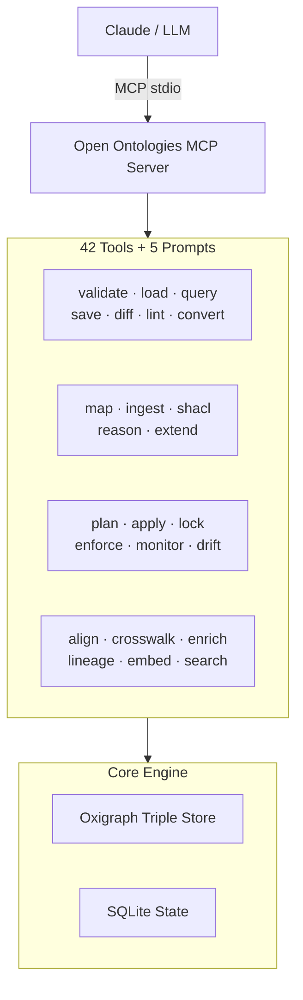
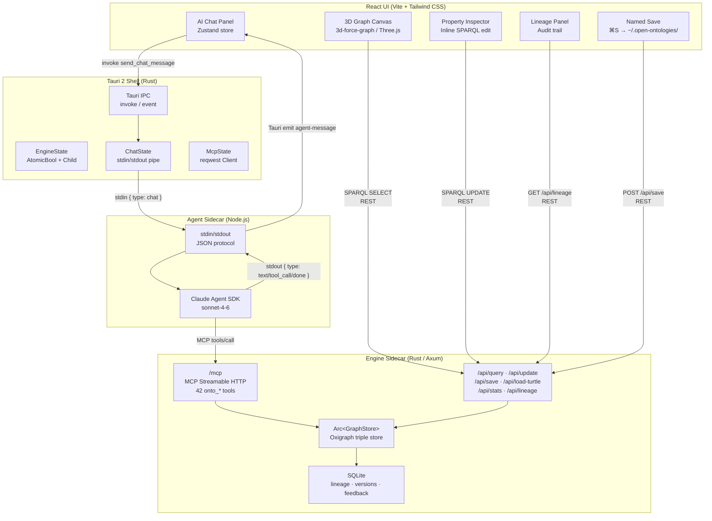

<!-- mcp-name: io.github.fabio-rovai/open-ontologies -->
# Open Ontologies

[](https://github.com/fabio-rovai/open-ontologies/actions/workflows/ci.yml)
[](LICENSE)
[](https://openmcp.org/servers/open-ontologies)
[](https://www.pitchhut.com/project/open-ontologies-mcp)
[](https://clawhub.ai/fabio-rovai/open-ontologies)

A Terraforming MCP for Knowledge Graphs — validate, classify, and govern AI-generated ontologies.

Open Ontologies is a **Rust MCP server** and **desktop Studio** for AI-native ontology engineering. It exposes 42 tools that let Claude (or any MCP client) build, validate, query, diff, lint, version, reason over, align, and persist RDF/OWL ontologies using an in-memory Oxigraph triple store — with Terraform-style lifecycle management, clinical crosswalks, semantic embeddings, and a full audit trail.

The **Studio** is a Tauri desktop app that wraps the engine in a visual environment: 3D force-directed graph, AI chat panel, Protégé-style property inspector, lineage viewer, and named save.

---

## Screenshots

| Full UI | 3D Graph |
|---|---|
|  |  |

*Forest ontology built entirely through natural language: "Build me an ontology about a forest ecosystem." Claude called `onto_clear` → `onto_load` → `onto_reason` → `onto_save` automatically.*

---

## Quick Start (MCP / CLI)

### Install

#### Pre-built binaries

```bash
# macOS (Apple Silicon)
curl -LO https://github.com/fabio-rovai/open-ontologies/releases/latest/download/open-ontologies-aarch64-apple-darwin
chmod +x open-ontologies-aarch64-apple-darwin && mv open-ontologies-aarch64-apple-darwin /usr/local/bin/open-ontologies

# macOS (Intel)
curl -LO https://github.com/fabio-rovai/open-ontologies/releases/latest/download/open-ontologies-x86_64-apple-darwin
chmod +x open-ontologies-x86_64-apple-darwin && mv open-ontologies-x86_64-apple-darwin /usr/local/bin/open-ontologies

# Linux (x86_64)
curl -LO https://github.com/fabio-rovai/open-ontologies/releases/latest/download/open-ontologies-x86_64-unknown-linux-gnu
chmod +x open-ontologies-x86_64-unknown-linux-gnu && mv open-ontologies-x86_64-unknown-linux-gnu /usr/local/bin/open-ontologies
```

#### Docker

```bash
docker pull ghcr.io/fabio-rovai/open-ontologies:latest
docker run -i ghcr.io/fabio-rovai/open-ontologies serve
```

#### From source (Rust 1.85+)

```bash
git clone https://github.com/fabio-rovai/open-ontologies.git
cd open-ontologies
cargo build --release
./target/release/open-ontologies init
```

### Connect to your MCP client

<details>
<summary><strong>Claude Code</strong></summary>

Add to `~/.claude/settings.json`:

```json
{
  "mcpServers": {
    "open-ontologies": {
      "command": "/path/to/open-ontologies/target/release/open-ontologies",
      "args": ["serve"]
    }
  }
}
```

Restart Claude Code. The `onto_*` tools are now available.
</details>

<details>
<summary><strong>Claude Desktop</strong></summary>

Add to `~/Library/Application Support/Claude/claude_desktop_config.json` (macOS) or `%APPDATA%\Claude\claude_desktop_config.json` (Windows):

```json
{
  "mcpServers": {
    "open-ontologies": {
      "command": "/path/to/open-ontologies/target/release/open-ontologies",
      "args": ["serve"]
    }
  }
}
```
</details>

<details>
<summary><strong>Cursor / Windsurf / any MCP-compatible IDE</strong></summary>

Add to your MCP settings (usually `.cursor/mcp.json` or equivalent):

```json
{
  "mcpServers": {
    "open-ontologies": {
      "command": "/path/to/open-ontologies/target/release/open-ontologies",
      "args": ["serve"]
    }
  }
}
```
</details>

<details>
<summary><strong>Docker</strong></summary>

```json
{
  "mcpServers": {
    "open-ontologies": {
      "command": "docker",
      "args": ["run", "-i", "--rm", "ghcr.io/fabio-rovai/open-ontologies", "serve"]
    }
  }
}
```
</details>

### Build your first ontology

```text
Build me a Pizza ontology following the Manchester University tutorial.
Include all 49 toppings, 22 named pizzas, spiciness value partition,
and defined classes (VegetarianPizza, MeatyPizza, SpicyPizza).
Validate it, load it, and show me the stats.
```

Claude generates Turtle, then automatically calls `onto_validate` → `onto_load` → `onto_stats` → `onto_lint` → `onto_query`, fixing errors along the way.

---

## Studio (Desktop App)

The Studio lives in [`studio/`](studio/) and provides a visual interface on top of the same engine.

### Prerequisites

- **Rust + Cargo** — `curl https://sh.rustup.rs -sSf | sh`
- **Node.js 18+** — `brew install node`

### First-time setup

```bash
# 1. Build the engine binary (from repo root)
cargo build --release

# 2. Install JS dependencies
cd studio && npm install
```

### Run

```bash
cd studio
PATH=/opt/homebrew/bin:/Users/fabio/.cargo/bin:$PATH npm run tauri dev
```

The `PATH` prefix is required because macOS doesn't expose Homebrew or Cargo to subprocess shells.

On startup Tauri will:

1. Compile the Rust shell (~1 min first run, fast after)
2. Start Vite dev server on `localhost:1420`
3. Open the app window
4. Spawn the engine sidecar (`open-ontologies serve-http --port 8080`)
5. Spawn the AI agent sidecar (Node.js, 3s after engine)

### Rebuild after changes

```bash
# Engine changes (src/):
cargo build --release

# Agent sidecar changes (studio/src-tauri/sidecars/agent/index.ts):
cd studio/src-tauri/sidecars/agent && npm run build
```

### Studio Features

#### 3D Graph Canvas

Live force-directed graph (Three.js / WebGL) of your OWL class hierarchy.

- **Drag** to orbit · **Scroll** to zoom · **Click node** to inspect · **Right-click** to add class · **Delete** to remove
- On load, fires two SPARQL queries: all `owl:Class` nodes + all `rdfs:subClassOf` edges
- Nodes are spheres with floating label sprites; selected node highlighted in amber
- Auto-refreshes after every agent mutation or UI edit via `window.__refreshGraph()`

#### AI Agent Chat

Natural language ontology engineering powered by Claude Sonnet 4.6 via the Agent SDK.

- Type any instruction: *"Add a Mammal hierarchy"*, *"Run OWL reasoning"*, *"Validate and fix issues"*
- Claude calls the engine's 42 MCP tools automatically, iterating until the result is correct
- After any mutation, the graph refreshes and the ontology is auto-saved
- Slash commands: `/build`, `/expand`, `/validate`, `/reason`, `/query`, `/stats`, `/save`

#### Property Inspector

Click any node to open a Protégé-style triple editor.

- Click any value to edit inline (Enter saves, Escape cancels)
- Hover a row to reveal the `×` delete button
- `+ Add` opens a form with predicate quick-pick (`rdfs:label`, `rdfs:subClassOf`, `owl:equivalentClass`, etc.) and Literal/URI toggle

#### Lineage Panel

Full audit trail of every agent action, stored in SQLite.

- Events grouped by session with a count badge
- Color-coded badges: `P` plan · `A` apply · `E` enforce · `D` drift · `M` monitor · `AL` align

#### Named Save

- Click `💾` or press **⌘S** to save with a custom filename
- All saves go to `~/.open-ontologies/<name>.ttl`
- Auto-save after every mutation writes to `~/.open-ontologies/studio-live.ttl`

### Keyboard Shortcuts

| Shortcut | Action |
| --- | --- |
| ⌘J | Toggle Chat panel |
| ⌘I | Toggle Inspector panel |
| ⌘S | Save As… |
| Delete / Backspace | Delete selected node |

---

## Why This Exists

Single-shot LLM ontology generation has real problems: no validation, no verification, no iteration, no persistence, no scale, no integration. Open Ontologies solves all of these with a proper RDF/SPARQL engine (Oxigraph) exposed as MCP tools that Claude calls automatically — and a desktop Studio that makes the results visible in real time.

---

## Tools

42 tools organized by function:

| Category | Tools | Purpose |
| -------- | ----- | ------- |
| **Core** | `validate`, `load`, `save`, `clear`, `stats`, `query`, `diff`, `lint`, `convert`, `status` | RDF/OWL validation, querying, and management |
| **Remote** | `pull`, `push`, `import-owl` | Fetch/push ontologies, resolve owl:imports |
| **Schema** | `import-schema` | PostgreSQL → OWL conversion |
| **Data** | `map`, `ingest`, `shacl`, `reason`, `extend` | Structured data → RDF pipeline |
| **Versioning** | `version`, `history`, `rollback` | Named snapshots and rollback |
| **Lifecycle** | `plan`, `apply`, `lock`, `drift`, `enforce`, `monitor`, `monitor-clear`, `lineage` | Terraform-style change management |
| **Alignment** | `align`, `align-feedback` | Cross-ontology class matching with self-calibrating confidence |
| **Clinical** | `crosswalk`, `enrich`, `validate-clinical` | ICD-10 / SNOMED / MeSH crosswalks |
| **Feedback** | `lint-feedback`, `enforce-feedback` | Self-calibrating suppression |
| **Embeddings** | `embed`, `search`, `similarity` | Dual-space semantic search (text + Poincaré structural) |
| **Reasoning** | `reason`, `dl_explain`, `dl_check` | Native OWL2-DL SHOIQ tableaux reasoner |

All tools are available both as MCP tools (prefixed `onto_`) and as CLI subcommands.

---

## Architecture

### Engine



### Studio



### Design decisions

| Decision | Reason |
| --- | --- |
| UI reads use sessionless REST API | No MCP session management needed for SPARQL queries or stats |
| UI writes use REST `/api/update` + `/api/save` | Avoids session lifecycle issues in the Tauri WebKit webview |
| Agent writes go through MCP `tools/call` | The Agent SDK manages its own MCP session; Claude needs the full tool set |
| Shared `Arc<GraphStore>` | All MCP sessions and all REST handlers operate on the same in-memory triple store |
| Agent sidecar over stdin/stdout | Keeps Node.js process isolated; Tauri manages lifecycle |

---

## Stack

| Layer | Tech |
| --- | --- |
| Engine | Rust (edition 2024), single binary |
| Triple store | Oxigraph 0.4 (pure Rust RDF/SPARQL) |
| MCP protocol | rmcp (Streamable HTTP transport) |
| State / lineage | SQLite (rusqlite) |
| Clinical crosswalks | Apache Arrow / Parquet |
| Embeddings | tract-onnx (pure Rust ONNX runtime, optional) |
| Desktop shell | Tauri 2 |
| Frontend | React 19, Vite 7, TypeScript 5.8, Tailwind CSS 4 |
| 3D graph | 3d-force-graph 1.79 (Three.js / WebGL) |
| UI state | Zustand 5 |
| AI agent | Claude Sonnet 4.6 via Agent SDK (Node.js sidecar) |

---

## Documentation

| Topic | Link |
| ----- | ---- |
| Quickstart | [docs/quickstart.md](docs/quickstart.md) |
| Data Pipeline | [docs/data-pipeline.md](docs/data-pipeline.md) |
| Ontology Lifecycle | [docs/lifecycle.md](docs/lifecycle.md) |
| Schema Alignment | [docs/alignment.md](docs/alignment.md) |
| OWL2-DL Reasoning | [docs/reasoning.md](docs/reasoning.md) |
| Semantic Embeddings | [docs/embeddings.md](docs/embeddings.md) |
| Clinical Crosswalks | [docs/clinical.md](docs/clinical.md) |
| Benchmarks | [docs/benchmarks.md](docs/benchmarks.md) |
| Contributing | [CONTRIBUTING.md](CONTRIBUTING.md) |
| Changelog | [CHANGELOG.md](CHANGELOG.md) |

---

## License

MIT

<a href="https://glama.ai/mcp/servers/fabio-rovai/open-ontologies"></a>
