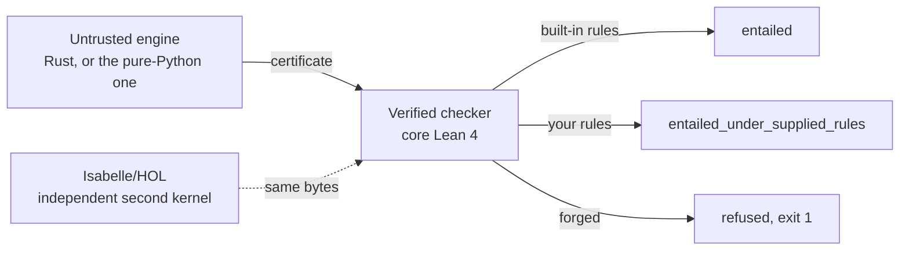

<!-- mcp-name: io.github.fabio-rovai/open-ontologies -->

<p align="center">
  
</p>

<h1 align="center">Open Ontologies</h1>

<p align="center">
  <strong>An engineering and verification platform for trustworthy ontologies and knowledge graphs</strong><br>
  Build, change and operate them with Terraform-style lifecycle management, and reason over them
  with proof-carrying inference. Written in Rust. Ships as a single binary.
</p>

<p align="center">
  <a href="https://tesseractsemantics.com"><strong>tesseractsemantics.com</strong></a>
</p>

<p align="center">
  <a href="https://tesseractsemantics.com"></a>
  <a href="https://github.com/fabio-rovai/open-ontologies/stargazers"></a>
  <a href="https://github.com/fabio-rovai/open-ontologies/actions/workflows/ci.yml"></a>
  <a href="LICENSE"></a>
  <a href="https://github.com/fabio-rovai/open-ontologies/pkgs/container/open-ontologies"></a>
  <a href="https://github.com/sponsors/fabio-rovai"></a>
</p>

<p align="center">
  <strong>English</strong> · <a href="README.zh-CN.md">简体中文</a>
</p>

---

Ask a reasoner why it believes something and it will tell you to trust it.

This one hands you the proof, and refuses a fake one. Run it yourself; the three files are in
the repository and the output below is what the checker printed, trimmed to the fields that matter.

```bash
$ cd lean && lake build            # builds the checkers, core Lean 4, no Mathlib
$ F=../tests/fixtures/horn

$ lake exe oo-horn check $F/builtin_rules.tsv $F/asserted.tsv $F/good.tsv
{"ok":true,"verdict":"entailed","theorem":"OOCert.entails_of_builtin_horn",
 "means":"every conclusion is true in every model of the asserted graph"}

$ lake exe oo-horn check $F/builtin_rules.tsv $F/asserted.tsv $F/bad_conclusion.tsv
{"ok":false}                        # one IRI in the conclusion changed. exit 1.

$ lake exe oo-horn check $F/user_rules.tsv $F/asserted.tsv $F/good.tsv
{"ok":true,"verdict":"entailed_under_supplied_rules","theorem":"OOCert.horn_certificate_sound"}
```

The third line is the one that matters. Same inference, but one of the rules was written by you,
so it is an assumption the certificate carries and not a fact it establishes. The verdict word
changes, and a test fails if it ever stops changing.


```mermaid
flowchart LR
  E["Untrusted engine<br/>Rust, or the pure-Python one"] -->|certificate| C["Verified checker<br/>core Lean 4"]
  I["Isabelle/HOL<br/>independent second kernel"] -.->|same bytes| C
  C -->|built-in rules| A["entailed"]
  C -->|your rules| B["entailed_under_supplied_rules"]
  C -->|forged| X["refused, exit 1"]
```

**What this discipline has caught, in one week of running it against this engine.** Five
description-logic false cleans, each an inconsistent ontology reported consistent with full
confidence. A rule that could conclude a triple no serialiser can write, reachable from ordinary
OWL, which left the store non-deterministic: three runs of one input kept 40, 9 and 24 inferences.
And two independently verified kernels disagreeing on the same certificates, always in the safe
direction, tracing to a gap in the format that neither proof could see: it did not say what a
repeated binding key meant, so one kernel refused the shape and the other answered from whatever
its lookup happened to do. A key bound twice to different values is satisfied by no substitution
at all, so there were never two readings, only two ways of discarding half the certificate. Closed
by [decision 0008](docs/decisions/0008-a-binding-is-data-and-evidence-admits-one-reading.md), and
the two kernels now return the same answer on every row of a corpus of 2,075 certificates, 484 of
which exercise the ordering property both inductions rest on, against 123 before that corpus was
deepened. Every one of those had passed every test that existed before.

The claim that the two kernels agree was, until 15 September 2026, checked by nothing here. No
workflow installed the second kernel, so the test that requires zero divergence skipped in the one
job that ran it and was invoked by no job that could have made it strict, and a skipped test
reports `ok`. CI runs both kernels over the whole corpus on every pull request now, and
[docs/ci-gates.md](docs/ci-gates.md) is the table of which other gates do and do not fire.

## What is actually proved

| You ask | You get back | Checked against |
| --- | --- | --- |
| Reason over OWL | A derivation certificate | `OOCert.certificate_sound` |
| Reason with rules you wrote | A certificate, and a different verdict word | `OOCert.horn_certificate_sound` |
| Is this satisfiable | A finite model | `Dl.satisfiable_of_checkModel` |
| Is a solver's model real | The model, replayed | `Fol.satisfiable_of_check` |
| Is this inconsistent | A refutation | `OOCert.refutation_sound` |
| Does this data fit the shapes | A validation report | `Shacl.validate_spec` |
| Does a retrieval slice still support the answer | Per-claim preservation | `OOCert.certificate_sound` |

That last row is the one to read twice. A retrieval slice at 99% coverage can have dropped the
one triple an answer depends on, and one at 60% can preserve every claim that matters. Coverage
is a proxy that rises as the slice grows, so a retriever tuned on it learns to fetch more rather
than the right thing. Entailment preservation is the property, it is decidable here, and it
carries a certificate per claim. See [decision 0007](docs/decisions/0007-a-slice-preserves-a-conclusion-or-it-does-not.md).

Measuring the loss is the second-best answer. The best one is a subset that cannot lose anything,
and `onto_module_extract` computes one: a syntactic locality module over a signature, where every
entailment of the whole ontology over those terms is still an entailment of the subset. That
guarantee is a theorem of Cuenca Grau, Horrocks, Kazakov and Sattler, JAIR 31 (2008), and it is
CITED rather than machine-checked, because nothing under [lean/](lean/) is about locality. The
report says exactly that, names no theorem of this project, and offers to measure the consequence
instead: reason the ontology and the module to a fixpoint and report every conclusion over the
signature the module does not reach. On this repository's own pizza ontology that is 238 of 1,345
axioms, and zero lost out of 2,583 differences examined. `onto_conservative_check` is the same
machinery pointed at the lifecycle: does adding these axioms change any consequence over the names
the ontology already used? See
[decision 0011](docs/decisions/0011-a-module-carries-a-theorem-and-a-slice-carries-a-measurement.md).

## What is NOT proved

Every line above is worth less if this section is missing, so it is here rather than in a file
nobody opens. These are the load-bearing limits, and none of them is hypothetical.

**The Rust engine is not verified.** The theorems are conditional on it reporting the run
faithfully. That boundary is twenty-nine properties: `make verify` bounded-model-checks six, and
five are enforced by the engine rather than observed of a dependency, two properties being in both
counts. Two are irreducible, because they are about an execution and not a function: that
`asserted.tsv` is the graph reasoned over, and that `derivations.tsv` covers every triple added.
Those are property-tested end to end, which is not proved.
[docs/trusted-computing-base.md](docs/trusted-computing-base.md) says which is which.

**The bridge to the specification is a theorem, and what stands in its place now is smaller and a
different kind of thing.** An OWL 2 RDF-Based interpretation is a Lean structure in its own right:
the parts of RBS Table 5.1 the rules reach, and RDF 1.1 Semantics section 5's truth clause with its
`I(p) ∈ IP` conjunct. `OOCert.Conforming.toW3C` proves that every such interpretation carries the
W3C conditions at full strength, and the five axiomatic-triple facts the old prose assumed are
discharged inside that proof, from five triples of the RDF and RDFS axiomatic tables carried as
quoted fields. `OOCert.certificate_conforming_sound` is then the sentence: a checked certificate's
conclusions are true, in the specification's own sense of true, in every interpretation meeting
those conditions that satisfies the asserted graph. One of the five facts was previously sourced to
a triple whose predicate is the wrong one, which is why it is now taken from
`rdf:type rdfs:range rdfs:Class .` instead.

What is left is a containment, not a reading: the condition list is a SUBSET of the
Recommendation's, which is the safe direction and is why it is allowed, and that it is a subset is
checked cell by cell by a reader rather than by Lean. Two smaller things are named at the file.
`IL` is total, following RBS section 4.2's wording, which excludes RDF 1.1 interpretations in which
a literal fails to denote; that one does not run in the safe direction, and closing it needs a
term-occurrence lemma about `checkStep` that nobody has written. And one reading is load-bearing:
RBS Table 5.4 at `n = 0`, which the engine's `cls-int1` already depends on for empty lists.

**Two kernels agreeing is weaker than it sounds.** They are theorems over model classes nobody has
ordered in either direction, so "both said entailed" means less than a reader would naturally take
it to mean. Lean's class is still larger than the specification's, so entailment transfers outward
for free and non-entailment does not: each one needs its own witness in the smaller class, and
every negative result about the built-in rules now has one.

**A non-vacuity witness can be vacuous where it matters**, and ours was. It satisfied nine of
twenty-one conditions only because the relevant extensions were empty, and six of the fourteen arms
rested entirely on those, which is the failure mode that most resembles success. It is rebuilt, and
the gate is now stronger than non-emptiness: every one of the fourteen derivations must fire at a
concrete instance, and every one of the twenty-one conditions must have a satisfied antecedent.

**Negative answers are mostly unchecked opinion.** A refutation cannot be replayed in core Lean, so
an "unsatisfiable" from any prover is testimony, not a certificate. One clash rule has a semantic
condition and is certified; the other sixteen are detected and deliberately carry no certificate.
A model is a finite object and can be checked, which is why satisfiability can be certified and
unsatisfiability cannot.

**Governance.** `main` requires the CI, Lean, SHACL-conformance and Python checks to pass, refuses
force pushes and deletion, and applies to administrators too. Commits are not signed: a signing key
was set up and then removed, because a passphrase-less key on a laptop is forgeable by anyone with
disk access, and a forgeable assurance signal is worse than none in a repository that makes
verification claims.

**The scope is wider than the idea.** The one genuinely new thing here is proof-carrying reasoning:
an engine that hands you evidence a separate verified checker accepts. The tool count, the Studio,
the embeddings, the crosswalks and the plugins are a product built around it, and they are not what
makes this different. If you are evaluating the claim, read
[docs/decisions/](docs/decisions/) and [lean/](lean/), and ignore the rest.

The second kernel is in [isabelle/](isabelle/), written from the W3C specifications with the Lean
deliberately unread, and it is run over the same bytes on every differential run.

Its sharpest catch was not a disagreement about a certificate. It was that fourteen arms of the
Lean's soundness proof, across twelve of its twenty-nine rules, were sound because a field of the
condition record said the rule holds. Twelve of those arms are stated by no cell of any
specification table. The proofs passed, the axiom footprints were clean, and the machine-checked
content for those arms was close to nothing. All fourteen are now derived from cells quoted out of
the specification's raw HTML, in [lean/OOCert/W3C.lean](lean/OOCert/W3C.lean), and
`OOCert.certificate_w3c_sound` restates the checker's verdict over every interpretation meeting
those cells, rather than over the weaker conditions this Lean used to posit. Same certificates,
same checker, and not one of those derivations depends on any axiom at all.

That step short of the specification has since been closed.
[lean/OOCert/Conforming.lean](lean/OOCert/Conforming.lean) builds the specification's own
interpretation in core Lean, so there is something to quantify over, and the reading that used to be
prose is `OOCert.Conforming.toW3C`. The five `IP` memberships the old bridge assumed are fields of
that structure, quoted out of the RDF and RDFS axiomatic-triple tables, and discharged in one step
each by section 5's truth clause. `OOCert.certificate_conforming_sound` is the sentence
`certificate_w3c_sound` said it was not yet, and
[lean/OOCert/ConformingWitness.lean](lean/OOCert/ConformingWitness.lean) exhibits an interpretation
satisfying every one of those conditions and every RDF and RDFS axiomatic triple, then names, as
checked theorems, which conditions it leaves untested and which Table 5.2 row it breaks.

The same review found the limit of that result. Entailment transfers outward and non-entailment does
not, so a `¬ Entails` here is about this layer's model class unless something restates it over the
stronger one. Five of the nine now are, four of them with their existing witness interpretations
unchanged, including the one a report's `entailed_under_supplied_rules` verdict rests on. The four
that are not carry the field that stops them as a machine-checked theorem. An earlier version of
this section said every conforming countermodel had to be hand-built; that was wrong, and the
correction is in [docs/lean-certificates.md](docs/lean-certificates.md) and in the changelog rather
than edited out of sight.

The discipline matters more than the machinery, and it runs through all of it.

A rule **you** supplied is an assumption the certificate carries, never a fact it establishes, so
it earns `entailed_under_supplied_rules` and never `entailed`. A model a solver hands back can be
checked and becomes a certificate; a refutation cannot be replayed in core Lean and stays an
oracle opinion. The two never share a word. Where something is measured rather than proved, the
documentation says measured, and [what the proofs assume about the Rust](docs/trusted-computing-base.md)
is written down rather than left implied.

The reasoning behind each of those rules is in [docs/decisions/](docs/decisions/), one file per
rule, each naming the failure it exists to prevent.

## Install

```bash
# macOS (Apple Silicon)
curl -LO https://github.com/fabio-rovai/open-ontologies/releases/latest/download/open-ontologies-aarch64-apple-darwin
chmod +x open-ontologies-aarch64-apple-darwin && mv open-ontologies-aarch64-apple-darwin /usr/local/bin/open-ontologies

# Linux (x86_64)
curl -LO https://github.com/fabio-rovai/open-ontologies/releases/latest/download/open-ontologies-x86_64-unknown-linux-gnu
chmod +x open-ontologies-x86_64-unknown-linux-gnu && mv open-ontologies-x86_64-unknown-linux-gnu /usr/local/bin/open-ontologies

# Docker
docker pull ghcr.io/fabio-rovai/open-ontologies:latest

# From source (Rust 1.85+)
cargo build --release --features embeddings,plugins,sql
```

Intel macOS, native Windows and the rest: [docs/quickstart.md](docs/quickstart.md) and
[docs/windows.md](docs/windows.md).

`serve` starts an MCP server speaking JSON-RPC over stdin and stdout, so on launch it appears to
hang while it waits for a client. That is expected. From a terminal, use the CLI subcommands
instead, such as `open-ontologies validate <file.ttl>`.

## Connect it to Claude

Add to `~/.claude/settings.json` for Claude Code, or to
`~/Library/Application Support/Claude/claude_desktop_config.json` for Claude Desktop:

```json
{
  "mcpServers": {
    "open-ontologies": {
      "command": "/path/to/open-ontologies",
      "args": ["serve"]
    }
  }
}
```

Restart, and the `onto_*` tools are available. Cursor, Windsurf, Zed and VS Code are in
[docs/quickstart.md](docs/quickstart.md).

## What is in the box

**116 tools** to build, validate, query, diff, lint, version, reason over, align, plan, certify
and govern RDF and OWL, over an in-memory Oxigraph store. A default build advertises all 116 tools.
Eight need an optional Cargo feature and return an error without it: four need `embeddings`, two
need `plugins`, two need `postgres` or `duckdb`. The published binaries and the GHCR image are
built with the default feature set, so they do not carry those eight.

The Python package `open-ontologies-lite` now reasons as well, in pure Python with no Rust
toolchain, and its certificates are checked by the same Lean binaries. It is a second engine, and
being untrusted costs nothing: the warrant was never in the engine.

`tools/horn_differential.py` runs both engines and the Lean checker over every RDF document the
repository tracks. **The two engines are not independent**: they run the same algorithm over the
same rule table and the Python's comments cite the Rust by file and line, so their agreement is
strong evidence against a transcription slip and close to none against a shared misreading of a
W3C rule. The independent leg is the Lean checker. The tool prints that caveat next to its
agreement count on every run, and
[docs/lean-certificates.md](docs/lean-certificates.md#known-limitations) states it as a limitation.

Alongside them, a marketplace of 33 standard ontologies, clinical crosswalks, semantic embeddings,
a lineage audit trail, and a desktop Studio with a virtualized ontology tree, an AI chat panel and
a Protégé-style inspector. No JVM. No Protégé.

## Documentation

| Topic | Link |
| --- | --- |
| Quickstart | [docs/quickstart.md](docs/quickstart.md) |
| Architecture | [docs/architecture.md](docs/architecture.md) |
| Derivation certificates and the Lean checkers | [docs/lean-certificates.md](docs/lean-certificates.md) |
| What the Lean proofs assume about the Rust | [docs/trusted-computing-base.md](docs/trusted-computing-base.md) |
| Which gates a green CI tick actually ran | [docs/ci-gates.md](docs/ci-gates.md) |
| First-order export, TPTP and Common Logic | [docs/first-order-export.md](docs/first-order-export.md) |
| Every reasoning system, and why each was used or refused | [docs/reasoning-systems-inventory.md](docs/reasoning-systems-inventory.md) |
| Design decisions, one rule per file | [docs/decisions/](docs/decisions/) |
| SHIQ reasoning | [docs/reasoning.md](docs/reasoning.md) |
| Schema alignment | [docs/alignment.md](docs/alignment.md) |
| Data pipeline | [docs/data-pipeline.md](docs/data-pipeline.md) |
| Ontology lifecycle | [docs/lifecycle.md](docs/lifecycle.md) |
| Locality modules and conservative extensions | [docs/modules-and-conservativity.md](docs/modules-and-conservativity.md) |
| Semantic embeddings | [docs/embeddings.md](docs/embeddings.md) |
| Clinical crosswalks | [docs/clinical.md](docs/clinical.md) |
| IES support | [ecosystem](docs/ies-ecosystem.md) · [alignment](docs/ies-alignment.md) · [SPARQL examples](docs/ies-examples.md) |
| Benchmarks | [docs/benchmarks.md](docs/benchmarks.md) |
| Determinism and corrected results | [docs/determinism.md](docs/determinism.md) |
| Windows | [docs/windows.md](docs/windows.md) |
| Contributing | [CONTRIBUTING.md](CONTRIBUTING.md) |

## Stack

Rust edition 2024, single binary, no JVM. Oxigraph 0.5 for RDF and SPARQL 1.1. `rmcp` for MCP over
streamable HTTP. SQLite for state, lineage and feedback. Lean 4 v4.33.1 for the checkers, core Lean
only, no Mathlib. Tauri 2, React 19 and Tailwind 4 for the Studio. Full table in
[docs/architecture.md](docs/architecture.md).

## Citation

- **Open Ontologies: Tool-Augmented Ontology Engineering with Stable Matching Alignment.** Fabio
  Rovai, 2026. [arXiv:2605.09184](https://arxiv.org/abs/2605.09184)
- **CIVeX: Causal Intervention Verification for Language Agents.** Fabio Rovai, 2026.
  [arXiv:2605.09168](https://arxiv.org/abs/2605.09168)

[`CITATION.cff`](CITATION.cff) carries machine-readable metadata and powers GitHub's "Cite this
repository" button.

## License

MIT. Maintained by [Fabio Rovai](https://github.com/fabio-rovai) at
[Tesseract Semantics](https://tesseractsemantics.com). If this is useful to you, you can support it
through [GitHub Sponsors](https://github.com/sponsors/fabio-rovai).
