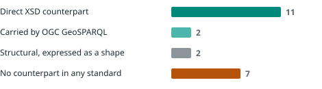
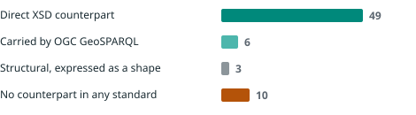
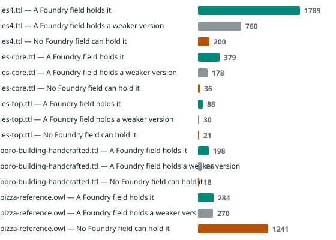

# Coverage report

Every figure on this page is written by `generate_report.py` from the
JSON that `foundry_owl.py` and `owl_to_foundry.py` produce. None is typed.

## Sources

| File | Repository | Licence | Bytes | SHA-256 (first 16) |
| --- | --- | --- | ---: | --- |
| `models.py` | palantir/foundry-platform-python | Apache-2.0 | 318020 | `2a54626dd6db96f3` |
| `core_models.py` | palantir/foundry-platform-python | Apache-2.0 | 31972 | `381fdb658b5cbae6` |
| `ies-common.ttl` | IES-Org/ont-ies | OGL / see repository | 264831 | `f742233837b6f43d` |
| `objectTypeV2.ts` | palantir/osdk-ts | Apache-2.0 | 17690 | `5e7c841bf840c046` |
| `linkTypes.ts` | palantir/osdk-ts | Apache-2.0 | 2356 | `e506ae26346101dd` |
| `spts.ts` | palantir/osdk-ts | Apache-2.0 | 961 | `4ac97ec8c19968d5` |
| `interfaceTypes.ts` | palantir/osdk-ts | Apache-2.0 | 3990 | `fd02f220d8134953` |

## The Foundry property type system

Palantir's `ObjectPropertyType` union declares 22 property types.
Parsed from their own SDK, not transcribed.

| Fidelity | Types | Meaning |
| --- | ---: | --- |
| direct | 11 | Direct XSD counterpart |
| standard | 2 | Carried by OGC GeoSPARQL |
| structural | 2 | Structural, expressed as a shape |
| none | 7 | No counterpart in any standard |

### Types with no counterpart in any standard

| Foundry type | Why it does not cross |
| --- | --- |
| `marking` | A Foundry security marking. No W3C standard carries access control. Exported as an opaque literal, the classification is no longer enforceable and no longer distinguishable from ordinary data. |
| `cipherText` | Ciphertext bound to a Foundry cipher channel. The channel reference is meaningless outside the platform. |
| `attachment` | A resource identifier pointing into Foundry blob storage. The value does not resolve outside the platform. |
| `mediaReference` | A reference into a Foundry media set. Does not resolve outside the platform. |
| `timeseries` | A handle onto a Foundry time series, not a value. The series itself is not in the export. |
| `geotimeSeriesReference` | A handle onto a Geotime integration. The track is not in the export. |
| `vector` | An embedding. The export declares its dimension and sometimes the producing model, but no W3C datatype carries a vector, so both become annotations rather than a range. |

## The crossing, measured on Palantir's own fixture

| Measure | Value |
| --- | ---: |
| Object types | 9 |
| Properties | 68 |
| Link sides | 6 |
| Interfaces | 2 |
| Shared property types | 1 |
| Inverse pairs recovered | 2 |
| owl:hasKey axioms written | 9 |
| Properties the crosswalk cannot carry | 10 |

### Documentation present in the source

The crosswalk never invents a definition. What the source omits stays omitted,
and the linter then reports it.

| Measure | Value |
| --- | ---: |
| Object types with no description | 5 of 9 |
| Properties with no description | 55 of 68 |

## The other direction

Each ontology below was parsed, its asserted constructs counted, and each
construct checked against the fields that exist in Palantir's ontology model.

| Ontology | Triples | Constructs used | Carried | Partial | No destination |
| --- | ---: | ---: | ---: | ---: | ---: |
| `ies-common.ttl` | 4039 | 8 | 1796 | 764 | 202 |
| `ies4.ttl` | 3976 | 8 | 1789 | 760 | 200 |
| `ies-core.ttl` | 1083 | 7 | 379 | 178 | 36 |
| `boro-building-handcrafted.ttl` | 355 | 8 | 198 | 66 | 18 |
| `pizza-reference.owl` | 2332 | 24 | 284 | 270 | 1241 |

### Where each ontology loses its axioms

**ies-common.ttl**

| Construct | Assertions | Why it has no destination |
| --- | ---: | --- |
| `rdfs:subPropertyOf` | 202 | No field arranges properties in a hierarchy. |

**ies4.ttl**

| Construct | Assertions | Why it has no destination |
| --- | ---: | --- |
| `rdfs:subPropertyOf` | 200 | No field arranges properties in a hierarchy. |

**ies-core.ttl**

| Construct | Assertions | Why it has no destination |
| --- | ---: | --- |
| `rdfs:subPropertyOf` | 36 | No field arranges properties in a hierarchy. |

**boro-building-handcrafted.ttl**

| Construct | Assertions | Why it has no destination |
| --- | ---: | --- |
| `rdfs:subPropertyOf` | 18 | No field arranges properties in a hierarchy. |

**pizza-reference.owl**

| Construct | Assertions | Why it has no destination |
| --- | ---: | --- |
| `owl:disjointWith` | 796 | No field asserts that two types cannot share a member. |
| `owl:Restriction` | 188 | No field carries a class defined by a condition on a property. |
| `owl:someValuesFrom` | 155 | Existential restriction has no Foundry field. |
| `owl:allValuesFrom` | 26 | Universal restriction has no Foundry field. |
| `owl:unionOf` | 25 | No field defines a class as a union. |
| `owl:equivalentClass` | 15 | No field asserts that two types have the same members. |
| `owl:intersectionOf` | 15 | No field defines a class as an intersection. |
| `owl:hasValue` | 6 | Value restriction has no Foundry field. |
| `rdfs:subPropertyOf` | 4 | No field arranges properties in a hierarchy. |
| `owl:InverseFunctionalProperty` | 3 | No field declares a property inverse functional. |
| `owl:complementOf` | 3 | No field defines a class as a complement. |
| `owl:TransitiveProperty` | 2 | No field declares a property transitive. |
| `owl:minCardinality` | 1 | Minimum cardinality has no Foundry field. |
| `owl:oneOf` | 1 | No field defines a class by enumeration. |
| `owl:AllDifferent` | 1 | No field asserts mutual difference. |

