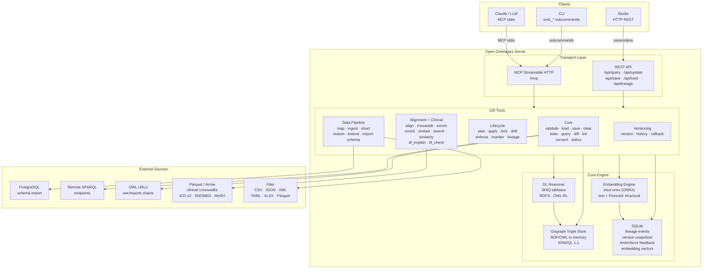
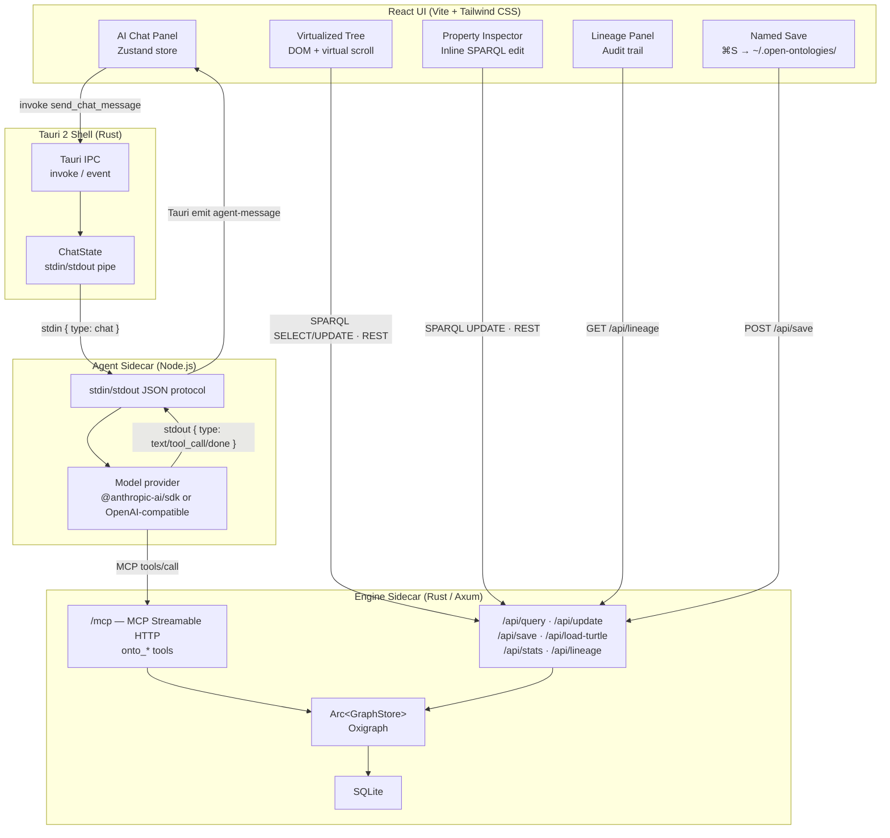

# Architecture

How the engine is put together: the layers, the tool groups, the data flow and where the
verified checkers sit relative to the untrusted parts.

Extracted from the README on 14 September 2026 so that the README could stay short enough to
read. Nothing here was rewritten in the move.

### Engine

### Certified inference

The forward-chaining reasoner (`rdfs`, `owl-rl`, `owl-rl-ext`) can write a
derivation certificate beside its result: `reason --certificate DIR` records
every inferred triple with the rule that produced it and the premises the rule
read. `lean/` holds a checker for that certificate whose soundness is a
machine-checked theorem (`OOCert.certificate_sound`, core Lean, no Mathlib), so
a run whose certificate checks contains only triples entailed by the asserted
graph, whatever this engine did to find them. CI builds the proofs and
certifies every RDF file in this repository, naming with a reason any it cannot
read or that exceeds the size cap. The first thing the checker caught
was in the engine: `cls-svf1` derived the converse of a subclass axiom. Details
in [docs/lean-certificates.md](docs/lean-certificates.md) and
[decision 0002](docs/decisions/0002-an-inference-carries-a-certificate.md).

The same run also looks for a contradiction, and writes `refutation.tsv` when it
finds one `oo-refute` can judge. Ten of the seventeen OWL 2 RL rules that
conclude `false` are detected; one of them, `cax-dw`, has a semantic condition
in `lean/` and is the only one a refutation is written for. The other nine are
reported as found by this engine and nothing more, because a file naming a rule
the checker cannot judge would be a certificate-shaped object that certifies
nothing. `cax-dw` needs an individual in two disjoint classes, so a TBox that is
unsatisfiable with no individual asserted is invisible to the rule-based route:
the `owl-dl` tableau sees that case and its answer carries no certificate.
### Rules you wrote

`reason --rules TABLE --certificate DIR` evaluates a rule table you supply and
writes a certificate `lake exe oo-horn check` verifies against
`OOCert.horn_certificate_sound`, one theorem proved for every rule table at
once. `rules-import --from swrl` reads SWRL rules out of a loaded ontology and
`--from rif` reads RIF Core out of its XML syntax, so the table need not be
hand-written.

Only a FRAGMENT of each language is a Horn table over triple patterns. SWRL
built-in atoms, same-individual and different-individual atoms and data ranges
are refused; RIF equality, `External`, `Expr`, `rif:local` constants, list terms
and the presentation syntax are refused. Each refusal is named and counted, and
by default one refusal fails the whole import: a rule set that quietly lost half
its rules still reaches a fixpoint and its certificate still checks green, which
is a sound proof about a rule set nobody wrote.

A rule you supply is an assumption nobody checked, so a certificate over it
earns `entailed_under_supplied_rules` — true in every model of the asserted
graph **that also satisfies your rules** — and never the `entailed` that only
the built-in table earns. Details in
[docs/rule-syntax-front-ends.md](docs/rule-syntax-front-ends.md) and
[decision 0003](docs/decisions/0003-a-rule-is-data-and-an-assumption-is-not-a-fact.md).
The theorem is conditional, and what it is conditional on is the Rust writing
down the truth: the asserted graph the certificate names, and the steps it
records. That boundary is small, it is the whole trusted base of this layer, and
it is enumerated as thirty checkable properties in
[docs/trusted-computing-base.md](docs/trusted-computing-base.md), with what
checks each and what is still trusted. Read it before relying on a certificate.

### Studio

### Design decisions

| Decision | Reason |
| --- | --- |
| UI reads use sessionless REST | No MCP session management needed for SPARQL queries or stats |
| UI writes use REST `/api/update` + `/api/save` | Avoids session lifecycle issues in the Tauri WebKit webview |
| Agent writes go through MCP `tools/call` | The sidecar's own MCP client (`studio/src-tauri/sidecars/agent/mcp.ts`) holds the session, and the model needs the full tool set |
| Shared `Arc<GraphStore>` | All MCP sessions and REST handlers share the same in-memory triple store |
| Agent sidecar over stdin/stdout | Keeps Node.js isolated; Tauri manages the full lifecycle |

