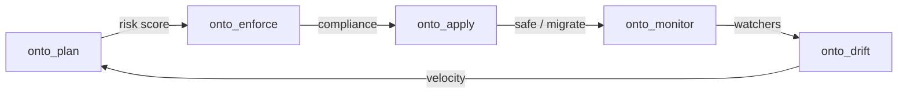

# Ontology Lifecycle

Production ontologies change over time. Open Ontologies provides Terraform-style lifecycle management.



## Plan

Diffs current vs proposed ontology. Reports added/removed classes, properties
and **individuals**, the triple-level delta, blast radius, and a risk score
(`low`/`medium`/`high`). Locked IRIs (`onto_lock`) prevent accidental removal.

The proposed Turtle is the complete desired state, as in Terraform: anything
absent from it is removed. The plan therefore reports instance data as well as
the TBox, because an apply deletes both — a removal of any kind is at least
`medium` risk, and `high` once other triples reference it.

Every plan is persisted in the state database and returned as a `plan_id`. Plans
therefore survive the process that computed them: `plan` and `apply` are
separate CLI invocations and separate MCP calls, and neither shares memory with
the other. The 100 most recent plans are retained.

## Enforce

Design pattern checks. Built-in packs: `generic` (orphan classes, missing labels), `boro` (IES4/BORO compliance), `value_partition` (disjointness). Custom SPARQL rules supported.

## Apply

Two modes: `safe` (write the delta) or `migrate` (same, plus
owl:equivalentClass/Property bridges for consumers).

Apply writes only the triples that differ, so an unchanged graph costs nothing
and a one-instance change touches one triple. `strategy` reports `delta`, or
`reload` when blank nodes are present anywhere in either graph: bnode labels are
store-local, so a set difference over them is meaningless and `DELETE DATA` /
`INSERT DATA` cannot carry them at all. The result is the same either way.

Applies the most recent plan by default. Pass a `plan_id` (`--plan-id` on the
CLI, `plan_id` to `onto_apply`) to apply a specific one; an id that does not
match a stored plan is an error rather than a silent fall-back to the latest.

"Most recent" is scoped to whoever computed the plan: one MCP session, or the
CLI as a whole. A single state db is shared by every session in HTTP mode, so an
unscoped default would let one session apply changes another was still
reviewing. Naming a `plan_id` still reaches across deliberately, and the error
says so when plans exist but belong to someone else.

```bash
oo plan proposed.ttl                    # prints plan_id
oo apply safe --plan-id plan-0a1b2c3d…  # or just: oo apply safe
```

### Rename bridges

`migrate` pairs each removed term with a replacement using `DriftDetector`, the
same calibrated rename detector `onto_drift` uses, assigned one-to-one so no
addition can be declared the replacement for two different removals. Pairs below
a name/label similarity of 0.6 are declined.

`owl:equivalentClass` is a hard logical assertion, so a wrong bridge is worse
than a missing one. Every bridge is reported with its similarity score in
`bridges`, and every removal the matcher declined is named in
`unbridged_removals` — check both before trusting a migration.

## Monitor

SPARQL watchers with threshold alerts. Actions: `notify`, `block_next_apply`, `auto_rollback`, `log`.

## Drift

Compares versions, detects renames via Jaro-Winkler similarity, computes drift velocity. Self-calibrating confidence via SQLite feedback loop.

## Lineage

Append-only audit trail of all lifecycle operations.

## Feedback

Lint and enforce learn from your decisions. Dismiss a warning 3 times and it's suppressed; accept it once and it sticks. Same self-calibrating pattern used by `align` and `drift`.
